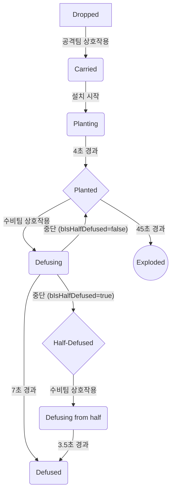

# 발로란트 스타일 3D 1인칭 하이퍼 FPS

---

# **VALORITHM - Valorant 모작 프로젝트**

[https://youtu.be/Ym0MJUSHHbc](https://youtu.be/Ym0MJUSHHbc)

## 🎮 프로젝트 개요

'VALORITHM'은 5v5 택티컬 FPS 게임 '발로란트’를 모작하여 4vs4의 형태로 구현한 게임입니다. 
본 프로젝트는 언리얼 엔진 5 환경에서 C++와 **게임플레이 어빌리티 시스템(GAS)** 을 중심으로 핵심 시스템을 구축했습니다. 특히 GAS를 기반으로 에이전트의 스킬 시스템을 모듈식으로 설계하여 확장성과 유지보수성을 확보했으며, 데이터 기반의 상점 및 경제 시스템을 구현하여 게임 밸런스 조절의 유연성을 높였습니다.

본 프로젝트에서 저는 **게임플레이 시스템 프로그래머**로서, 플레이어의 핵심 경험을 좌우하는 주요 기능들의 아키텍처 설계 및 구현을 담당했습니다. 특히 `GAS`를 활용한 확장 가능한 스킬 시스템, 네트워크 동기화된 상점/경제 시스템, 그리고 FPS의 핵심인 1/3인칭 뷰 처리와 복합적인 스킬 매커니즘 개발에 중점을 두었습니다.

- **장르:** 5v5 택티컬 FPS
- **개발 기간:** 2025.06.08
- **개발 인원:** 7명  (Unreal Part 4명, AI Part 3명)
- **주요 기술:** Unreal Engine 5, C++, Gameplay Ability System, UMG
- **본인 기여도:** 25 %

## 🧑‍💻 담당 역할 및 기여도

**게임플레이 시스템 프로그래머 (Gameplay Systems Programmer)**

- **총괄: GAS(Gameplay Ability System) 기반 핵심 게임플레이 아키텍처 설계**
    
    본 프로젝트의 가장 핵심적인 스킬 및 캐릭터 상호작용 시스템을 언리얼 엔진의 Gameplay Ability System(GAS)을 기반으로 설계하고 총괄 구현했습니다. 이는 단순한 스킬 구현을 넘어, GAS의 주요 컴포넌트들을 적극적으로 활용하여 확장 가능하고 데이터 기반의 유연한 아키텍처를 구축하는 것을 목표로 했습니다.
    
    - **C++/블루프린트 하이브리드 프레임워크 구축**: 복잡하고 성능에 민감한 로직은 C++ 기반 클래스(`UBaseGameplayAbility`, `ABaseProjectile` 등)에 구현하고, VFX/SFX 에셋 할당이나 수치 조절 등 잦은 변경이 필요한 요소는 블루프린트에서 처리할 수 있는 **하이브리드 프레임워크**를 구축했습니다. 이를 통해 프로그래머는 핵심 로직에, 기획/아티스트는 시각적 표현에 집중할 수 있는 효율적인 협업 환경을 만들었습니다 
    [cite: Valorant/AgentAbility/BaseProjectile.h, Valorant/AgentAbility/BaseGround.h].
    - **통합 어빌리티 프레임워크 (`UBaseGameplayAbility`)**: 모든 스킬의 공통 기반이 되는 `UBaseGameplayAbility`를 설계하여, 상태 머신, 다양한 입력 방식, 네트워크 동기화 로직을 내재화했습니다. 특히 어빌리티의 상태(`Preparing`, `Waiting` 등)와 연계하여 플레이어의 입력을 동적으로 제어하는 **지능형 입력 시스템**을 설계하여, '후속 입력'과 같은 복잡한 조작시스템을 구현했습니다.
    [cite: Valorant/AbilitySystem/Abilities/BaseGameplayAbility.h, Valorant/Player/Component/AgentInputComponent.cpp].
    - **어빌리티 관리의 중심 (`AbilitySystemComponent`)**: 캐릭터의 능력치를 관장하는 `UAbilitySystemComponent`(ASC)를 커스터마이징(`UAgentAbilitySystemComponent`)하여, `PlayerState`로부터 데이터를 받아 캐릭터 생성 시점에 적절한 어빌리티들을 부여하고, 속성(Attribute) 변화에 즉각적으로 반응하며, 후속 입력과 같은 복합적인 입력 이벤트를 해당 어빌리티에 정확히 전달하는 등, 캐릭터의 모든 능력을 중앙에서 관리하고 제어하는 핵심 허브를 구현했습니다
    [cite: Valorant/AbilitySystem/AgentAbilitySystemComponent.cpp].
    - **상태 및 효과 관리 (`GameplayTag` & `GameplayEffect`)**: '제압', '치유 중'과 같은 모든 캐릭터의 상태를 `GameplayTag`로 관리하고, 피해/치유, 버프/디버프 등 모든 수치적 변화를 `GameplayEffect`로 처리하여, 모든 상호작용을 데이터 기반으로 명확하고 일관되게 관리했습니다.
    [cite: Valorant/AbilitySystem/ValorantGameplayTags.h].
    - **상세 스킬 구현 (`GameplayEffect`)**: '제압', '스킬 사용 중'과 같은 모든 캐릭터의 상태를 `GameplayTag`로 관리하고, 피해/치유, 버프/디버프 등 모든 수치적 변화를 `GameplayEffect`로 처리하여, 모든 상호작용을 데이터 기반으로 명확하고 일관되게 관리했습니다.
    [cite: Valorant/AbilitySystem/ValorantGameplayTags.h].
    - **비동기 처리 (`GameplayTask`)**: `UPlayMontageWithEvent`와 같은 커스텀 `GameplayTask`를 구현하여, "애니메이션 재생이 특정 지점에 도달하면 투사체를 발사"하는 것과 같이 애니메이션과 게임 로직을 정교하게 동기화하는 비동기 로직을 구현했습니다 
    [cite: Valorant/AbilitySystem/Tasks/PlayMontageWithEvent.cpp].
    - **높은 생산성 달성**: 이처럼 견고하게 설계된 아키텍처 덕분에, 짧은 프로젝트 기간 내에 **4개 요원의 일반 스킬 12종** 을 기획에 충실한 로직, 1-3인칭 애니메이션, VFX, SFX, 투사체 물리 효과까지 모두 포함하여 높은 완성도로 구현하는 생산성을 달성할 수 있었습니다.
- **데이터 기반 상점 및 경제 시스템 개발**: `UCreditComponent`와 `UShopComponent`를 통해 라운드 결과, 킬/데스에 따른 크레딧 획득 및 아이템 구매 로직을 서버 권위적으로 구현했습니다. 특히, 데이터 테이블을 통해 상점 UI를 동적으로 생성하고, 서버-클라이언트 간 명확한 피드백 루프를 구축하여 안정적인 구매 경험을 제공했습니다 
[cite: Valorant/Player/Component/ShopComponent.cpp, Valorant/Player/Component/CreditComponent.cpp, Valorant/UI/MatchMap/MatchMapShopUI.cpp].
- **전술적 핵심 오브젝트 '스파이크' 시스템 구현**: 게임의 승패를 결정하는 스파이크의 상태(`ESpikeState`) 머신을 설계하고, 공격/수비팀에 따른 각기 다른 상호작용과 '반 해체'와 같은 세부 규칙까지 서버-클라이언트 환경에서 안정적으로 동작하도록 개발했습니다 
[cite: ValorantObject/Spike/Spike.cpp].
- **몰입형 플레이어 시스템 설계**:
    - **현실성을 더한 섬광 시스템**: 플레이어의 시야각, 거리, 장애물 유무를 종합적으로 판단하여 섬광 효과의 강도와 지속시간을 차등 적용하는 시스템을 구현했습니다 
    [cite: Valorant/Player/Component/FlashComponent.cpp].
    - **FPS 뷰 모델 및 애니메이션 분리**: 1인칭과 3인칭 스켈레탈 메시를 분리하고, 스킬 사용 시 각 뷰에 적합한 애니메이션 몽타주가 재생되도록 하여 1인칭의 몰입감과 3인칭의 자연스러운 움직임을 모두 만족시켰습니다 
    [cite: Valorant/Player/Agent/BaseAgent.cpp].
    - **상황인지 기반 사운드 시스템**: 스킬의 준비/대기 단계에서는 시전자에게만 피드백 사운드를, 실행 단계에서는 `Multicast RPC`를 통해 모든 플레이어에게 중요한 사운드 효과를 제공하는 명확한 원칙을 수립하고 구현했습니다.

## 🏛️ 시스템 아키텍처 Deep Dive

### 1. 개발 효율 극대화를 위한 C++/블루프린트 하이브리드 아키텍처

본 프로젝트의 핵심 설계 철학은 **'성능과 안정성은 C++로, 유연성과 편의성은 블루프린트로'** 입니다. 이를 위해 스킬 시스템의 각 요소를 체계적으로 분리하고, 역할에 맞는 기반 클래스를 C++로 구현했습니다. 이를 통해 프로그래머가 아닌 팀원도 블루프린트의 인스펙터 창에서 값을 수정하고 에셋을 교체하는 것만으로 스킬의 외형과 동작을 대부분 커스터마이징할 수 있는 강력한 개발 파이프라인을 구축했습니다.

### **1.1. 설계 원칙: 로직과 데이터의 분리**

- **C++ (코어 로직)**: 상태 머신, 네트워크 복제, 복잡한 충돌 계산, 성능에 민감한 로직 등 스킬의 '뼈대'가 되는 부분은 모두 C++ 기반 클래스에 구현했습니다.
- **블루프린트 (데이터 및 외형)**: C++ 기반 클래스를 상속받는 블루프린트에서는 VFX/SFX 에셋, 스켈레탈 메시, 투사체 속도나 피해량 같은 구체적인 수치 등, 기획/디자인 단계에서 잦은 수정이 필요한 '데이터'와 '외형'을 설정합니다.

### **1.2. 재사용 가능한 C++ 기반 클래스**

- **`ABaseProjectile` (기본 투사체)**: 모든 투사체 스킬의 기반이 되는 클래스입니다. `UProjectileMovementComponent`를 내장하여 기본적인 물리 로직을 포함하고, `TrailVFX`, `ExplosionVFX`, `InitialSpeed` 등의 핵심 변수를 `UPROPERTY(EditDefaultsOnly)`로 노출시켜 블루프린트에서의 커스터마이징을 극대화했습니다
[cite: Valorant/AgentAbility/BaseProjectile.h].
- **`ABaseGround` (기본 장판)**: 특정 영역에 지속적인 효과를 주는 모든 스킬의 기반입니다. 영역 감지를 위한 `UBoxComponent`와 주기적으로 `GameplayEffect`를 적용하는 로직을 C++에 구현하고, 어떤 종류의 효과를 줄 것인지(`DamageGameplayEffect`), 어떤 시각 효과를 보여줄 것인지(`GroundVFX`)는 블루프린트에서 선택하도록 설계했습니다 
[cite: Valorant/AgentAbility/BaseGround.h].

### **1.3. `UBaseGameplayAbility`: 모든 것을 지휘하는 컨트롤 타워**

`UBaseGameplayAbility`는 `TSubclassOf<ABaseProjectile> ProjectileClassToSpawn`과 같은 변수를 노출하여, 기획/아트 팀이 미리 작업해 둔 투사체/장판 블루프린트를 선택하여 할당하는 것만으로 스킬의 핵심 로직과 외형을 연결할 수 있게 해줍니다. 이로써 **'어빌리티(로직) → 투사체/장판(외형 및 데이터)'**의 명확한 흐름이 완성되어 팀의 병렬적인 작업 효율을 극대화했습니다.

### **1.4. 어빌리티 상태와 연계된 지능적인 입력 제어 시스템**

**도전 과제:**
세이지의 '장벽 구슬'처럼 스킬을 손에 든 상태에서는 좌클릭으로 설치하고 우클릭으로 회전시켜야 합니다. 즉, 평소에 '총 발사'를 담당하던 입력이 일시적으로 '스킬 조작'을 위해 재정의되어야 합니다. 또한 이 상태는 스킬을 드는 애니메이션이 끝난 후에만 활성화되어야 하며, 이 상태에서는 무기 교체나 다른 스킬 사용 등 원치 않는 행동이 제한되어야 합니다.

**해결 방안: `GameplayTag`를 이용한 상태 기반 입력 라우팅(Routing)**
저는 이 문제를 해결하기 위해 `UBaseGameplayAbility`의 상태 머신과 `UAgentInputComponent`를 `GameplayTag`로 연결하는 지능형 입력 시스템을 설계했습니다.

1. **입력 차단 (`Preparing` 상태)**: `UBaseGameplayAbility`가 `WithPrepare` 타입으로 활성화되면, 상태를 `Preparing`으로 전환하고 플레이어의 `AbilitySystemComponent`에 **`State.Ability.IsUsing`** 태그를 부여합니다. `UAgentInputComponent`는 `Fire`, `Reload`, `WeaponSwitch` 같은 모든 입력을 처리하기 전에, 이 태그의 존재 여부를 먼저 확인합니다. 태그가 있다면 해당 입력을 무시하여, 스킬을 드는 동안 다른 행동을 할 수 없도록 원천적으로 차단합니다.
2. **후속 입력 대기 (`Waiting` 상태)**: `Preparing` 상태에서 `PlayMontage` 태스크를 통해 재생한 준비 동작 애니메이션이 끝나면, 어빌리티는 상태를 `Waiting`으로 전환합니다. 이때, **`State.Ability.IsUsing`** 태그를 제거하고, 대신 **`State.Ability.WaitingForInput`** 태그를 새롭게 부여합니다.
3. **입력 재정의 (Input Hijacking)**: 이제 `UAgentInputComponent`의 `Fire` 함수는 다음과 같이 동작합니다.
    - 플레이어가 좌/우클릭을 하면, `Fire` 함수는 가장 먼저 **`State.Ability.WaitingForInput`** 태그가 있는지 확인합니다.
    - 태그가 **있다면**, 이는 "현재 활성화된 어빌리티가 후속 입력을 기다리고 있다"는 의미이므로, 무기를 발사하는 대신 `UAgentAbilitySystemComponent::SendFollowUpInputToAbility` 함수를 호출하여 현재 활성 어빌리티에 입력 신호를 전달합니다.
    - 태그가 **없다면**, 평소처럼 무기를 발사하는 로직을 수행합니다.

```
// Valorant/Player/Component/AgentInputComponent.cpp
void UAgentInputComponent::Fire()
{
    if (MyASC && MyAgent)
    {
        // 1. 후속 입력을 기다리는 상태인지 먼저 확인
        if (MyASC->HasMatchingGameplayTag(FGameplayTag::RequestGameplayTag(TEXT("State.Ability.WaitingForInput"))))
        {
            // 그렇다면, 입력 이벤트를 어빌리티로 전달
            MyASC->SendFollowUpInputToAbility(FGameplayTag::RequestGameplayTag(TEXT("Input.LeftClick")));
        }
        // 2. 다른 스킬을 사용 중인지 확인
        else if (!MyASC->HasMatchingGameplayTag(FGameplayTag::RequestGameplayTag(TEXT("State.Ability.IsUsing"))))
        {
            // 두 조건 모두 아니라면, 평소처럼 무기 발사
            MyAgent->GetCurrentWeapon()->Fire();
        }
    }
}

```

이러한 `GameplayTag` 기반의 입력 라우팅 설계를 통해, 플레이어의 상태에 따라 동일한 키가 완전히 다른 역할을 수행하도록 유연하게 제어할 수 있었으며, 모든 로직이 `UBaseGameplayAbility`의 상태 머신과 유기적으로 연동되어 매우 안정적이고 예측 가능하게 동작합니다.

### 2. 핵심 게임플레이 시스템 상세 구현

### 2.1. 고급 어빌리티 구현 쇼케이스: 기술적 도전과 해결

`UBaseGameplayAbility`와 기반 클래스 프레임워크를 활용하여, 복잡한 요구사항을 가진 스킬들을 어떻게 기술적으로 해결했는지 구체적인 사례를 통해 보여드립니다.

### **사례 1: 피닉스 'Blaze' - 동적 곡선 장벽 생성**

**도전 과제:**
피닉스의 'Blaze'는 플레이어의 조작에 따라 직선 또는 곡선으로 지형의 높낮이에 맞춰 생성되는 불의 장벽입니다. 초기에는 작은 큐브 메시들을 경로를 따라 생성하는 방식을 시도했으나, 경사로나 비정형 지형에서 '계단 현상'이 발생하고 다수의 액터 생성으로 인한 성능 저하가 우려되었습니다.

**해결 방안: `SplineComponent`를 활용한 동적 메시 생성**
이 문제를 해결하기 위해, 저는 `USplineComponent`와 `USplineMeshComponent`를 활용하는 방식을 고안하고 구현했습니다.

1. **경로 탐색용 투사체 발사**: `UPhoneix_C_Blaze` 어빌리티가 활성화되면, 플레이어의 시점을 따라 날아가는 보이지 않는 투사체(`APhoenix_C_BlazeProjectile`)를 발사합니다. 이 투사체는 지형과의 충돌을 감지하며 이동 경로상의 위치 좌표들을 기록합니다.
2. **스플라인 경로 구축**: 투사체의 비행이 끝나면, 기록된 위치 좌표들을 사용하여 `APhoenix_C_BlazeSplineWall` 액터 내부의 `USplineComponent`에 경로를 설정합니다. 이로써 지형의 높낮이를 따라가는 부드러운 3차원 곡선 경로가 생성됩니다.
3. **동적 메시 생성**: `APhoenix_C_BlazeSplineWall` 액터는 `Tick` 함수에서 자신의 `USplineComponent` 경로를 따라 여러 개의 `USplineMeshComponent`를 동적으로 생성하고 이어 붙입니다. 각 `USplineMeshComponent`는 스플라인의 시작점과 끝점, 그리고 각 점의 탄젠트(Tangent) 값을 이용하여 자연스럽게 휘어지고 늘어납니다. 이 방식은 적은 수의 컴포넌트로 매우 길고 부드러운 곡선 벽을 효율적으로 렌더링하여, 계단 현상과 성능 문제를 동시에 해결했습니다 
[cite: Valorant/AbilitySystem/Abilities/Phoenix/Phoenix_C_BlazeSplineWall.cpp].

### **사례 2: 세이지 'Barrier Orb' - 클라이언트 예측 기반의 실시간 미리보기**

**도전 과제:**
세이지의 장벽 스킬은 설치 전, 플레이어가 원하는 위치에 장벽의 '미리보기'를 보고, 이를 회전시킨 후 최종적으로 설치해야 합니다. 이 모든 과정이 멀티플레이어 환경에서 다른 플레이어에게는 영향을 주지 않으면서 로컬 플레이어에게는 즉각적으로 반응해야 하는 복잡한 요구사항을 가집니다.

**해결 방안: 로컬 액터와 서버 RPC를 이용한 역할 분리**

1. **준비 및 미리보기 생성 (`Preparing` 상태)**: `USage_C_BarrierOrb` 어빌리티가 활성화되면, 서버가 아닌 **로컬 클라이언트에서만** 미리보기용 액터인 `ABarrierOrbActor`를 생성합니다. 이 액터는 `bReplicates` 플래그가 `false`로 설정되어 다른 플레이어에게는 보이지도, 존재하지도 않습니다.
2. **실시간 위치 업데이트 (클라이언트-사이드)**: `Tick` 함수에서 로컬 플레이어의 시점을 기준으로 매 프레임 `LineTrace`를 수행하여 `ABarrierOrbActor`의 위치를 실시간으로 업데이트합니다. 이는 순수하게 클라이언트 내부에서만 일어나므로 네트워크 지연 없이 즉각적인 피드백을 제공합니다.
3. **미리보기 회전 (클라이언트-사이드)**: 플레이어가 우클릭(`OnRightClickInput`)을 하면, `ABarrierOrbActor`의 회전 값을 변경하는 함수가 로컬에서만 호출됩니다. 이 또한 다른 플레이어와는 무관한 로컬 연산입니다.
4. **최종 설치 요청 (서버 RPC)**: 플레이어가 좌클릭(`OnLeftClickInput`)으로 위치를 확정하면, 어빌리티는 `ABarrierOrbActor`의 최종 위치(Transform)와 회전 정보를 담아 `ServerRPC_SpawnBarrierWall` 함수를 호출합니다.
5. **서버 권위적 생성 및 복제**: 서버는 RPC를 통해 전달받은 Transform 정보를 바탕으로, **실제 장벽 액터인 `ABarrierWallActor`를 생성**합니다. 이 액터는 `bReplicates`가 `true`이고 충돌 설정이 되어 있으므로, 생성 즉시 모든 클라이언트에 복제되어 나타나며 물리적인 장벽 역할을 수행하게 됩니다.

이러한 역할 분리를 통해, 복잡하고 잦은 상호작용(위치/회전 미리보기)은 네트워크 부하 없이 클라이언트에서 처리하고, 게임의 상태를 실제로 변경하는 최종적인 행동(장벽 생성)만 서버에 요청함으로써 매우 반응성이 좋고 안정적인 스킬 사용 경험을 구현할 수 있었습니다 [cite: Valorant/AbilitySystem/Abilities/Sage/Sage_C_BarrierOrb.cpp, Valorant/AbilitySystem/Abilities/Sage/BarrierOrbActor.cpp, Valorant/AbilitySystem/Abilities/Sage/BarrierWallActor.cpp].

### 2.2. 현실성을 더한 네트워크 동기화 섬광 시스템

단순히 화면을 하얗게 만드는 것을 넘어, 플레이어가 실제 섬광탄에 노출된 것 같은 몰입감을 주기 위해 복합적인 요소를 고려한 시스템을 설계하고 구현했습니다. 모든 계산은 서버에서 권위적으로 처리되며, 시각적 표현은 각 클라이언트에서 최적화된 방식으로 이루어집니다.

### **단계 1: 서버의 권위적 효과 판정**

`AFlashProjectile`이 폭발하면, 서버는 폭발 지점 근처의 모든 플레이어에 대해 `UFlashComponent::CalculateFlashDuration` 함수를 호출하여 섬광 효과를 받을지, 받는다면 얼마나 오래 받을지를 결정합니다.

1. **장애물 검사**: 플레이어의 눈(카메라 위치)과 폭발 지점 사이에 `LineTraceByChannel`을 수행하여 벽과 같은 장애물이 있는지 확인합니다. 장애물이 있다면 섬광 효과는 적용되지 않습니다.
2. **시야각 계산**: 장애물이 없다면, 플레이어의 시선 방향과 폭발 지점을 향하는 방향 사이의 각도(내적, Dot Product)를 계산합니다. 시선이 폭발 지점에 가까울수록(내적 값이 1에 가까울수록) 효과가 강해집니다.
3. **거리 감쇠 계산**: 폭발 지점과 플레이어 사이의 거리를 계산하여, 거리가 멀어질수록 효과가 약해지도록 감쇠 공식을 적용합니다.

| 조건 | 시야각 (내적) | 거리 (유닛) | 장애물 | 최종 지속시간 (예시) |
| --- | --- | --- | --- | --- |
| 정면 응시 (5m) | 0.9 | 500 | 없음 | 2.5초 |
| 곁눈질 (5m) | 0.3 | 500 | 없음 | 0.8초 |
| 등 돌림 (5m) | -0.8 | 500 | 없음 | 0초 |
| 정면 응시 (15m) | 0.9 | 1500 | 없음 | 1.0초 |
| 벽 뒤에 숨음 (5m) | 0.9 | 500 | 있음 | 0초 |

### 2.3. 네트워크 동기화된 상점 및 경제 시스템

라운드 시작 시 아이템을 구매하는 단계는 게임의 전략성을 구성하는 핵심 요소입니다. 저는 데이터 기반 초기화, 서버 권위적 처리, 명확한 UI 피드백이라는 세 가지 원칙하에 상점 시스템을 설계했습니다.

- **데이터 기반 UI 초기화**: 상점 UI(`UMatchMapShopUI`)는 데이터 테이블로부터 `FValorantShopData` 배열을 읽어 동적으로 구성됩니다. 기획자는 데이터 테이블 수정만으로 요원별 판매 스킬, 최대 구매량, 아이콘, 비용 등을 자유롭게 변경할 수 있습니다 [cite: Valorant/UI/MatchMap/MatchMapShopUI.cpp].
- **서버 권위적 구매 흐름**: 클라이언트의 구매 요청(`RequestPurchaseSkill`)은 서버 RPC를 통해 서버에서만 검증됩니다. 서버는 플레이어의 크레딧과 스킬 보유량을 확인한 후, 유효한 경우에만 `PlayerState`의 데이터를 변경합니다. 변경된 데이터는 `Replicated` 속성을 통해 모든 클라이언트에 자동으로 동기화됩니다 [cite: Valorant/Player/Component/ShopComponent.cpp].
- **명확한 UI 피드백**: 구매가 실패하면(크레딧 부족, 최대 보유량 도달 등), 서버는 요청한 클라이언트에게만 `ClientRPC_PurchaseFailed`를 호출합니다. UI는 이 신호를 받아 "크레딧이 부족합니다"와 같은 명확한 실패 사유를 화면에 표시하여 사용자 경험을 향상시켰습니다.

### 2.4. 핵심 목표 시스템: 스파이크

스파이크는 게임의 승패를 가르는 핵심 오브젝트입니다. 저는 `ASpike` 액터에 상태 머신을 구현하여, 멀티플레이어 환경에서 발생할 수 있는 다양한 동시성 이슈를 방지하고 명확한 규칙에 따라 작동하도록 설계했습니다.

### **상태 변화 흐름도**



### **팀별 상호작용 규칙**

| 상태 (State) | 공격팀 상호작용 | 수비팀 상호작용 | 핵심 로직 |
| --- | --- | --- | --- |
| `Dropped` | **줍기 (TryCarrySpike)** | 불가능 | 스파이크를 소유한 플레이어가 없으면 즉시 소지 상태로 변경. |
| `Carried` | **설치 (StartPlanting)** | 불가능 | 4초간 상호작용 키를 누르고 있어야 `Planted` 상태로 전환. |
| `Planted` / `Half-Defused` | 불가능 | **해체 (StartDefusing)** | 7초간 상호작용 필요. 3.5초 경과 시 '반 해체'(`Half-Defused`) 상태가 되어 중간 사운드 큐 발생. |
| `Defusing` | 불가능 | **해체 계속** / **중단** | 키를 떼거나 사망 시 해체 중단. |

이러한 명확한 상태 머신과 규칙 기반의 상호작용 설계는 복잡한 동시성 문제를 예방하고, 모든 플레이어에게 일관되고 예측 가능한 게임 경험을 제공합니다 [cite: ValorantObject/Spike/Spike.cpp].

### **단계 2: 클라이언트의 동적 시각 효과**

서버로부터 지속 시간과 폭발 위치를 전달받은 클라이언트는 `UFlashWidget`을 통해 다음과 같은 동적 시각 효과를 구현합니다.

1. **방사형 섬광 위치 동기화**: `ProjectWorldToScreen` 함수를 사용해 3D 월드 상의 폭발 위치를 2D 화면 좌표로 변환합니다. 이 좌표를 기준으로 `UFlashWidget` 내의 방사형 섬광 이미지(Radial Blur)의 위치를 실시간으로 조절하여, 플레이어가 폭발이 일어난 방향을 직관적으로 인지할 수 있게 했습니다 [cite: Valorant/UI/FlashWidget.cpp].
2. **페이드인/페이드아웃**: 섬광 효과가 최대치에 도달했다가 서서히 사라지는 과정을 UMG의 애니메이션 커브를 이용하여 부드러운 페이드인/아웃 효과로 구현했습니다. 이를 통해 갑작스러운 화면 전환으로 인한 시각적 불편함을 줄이고 현실감을 높였습니다.

### 3. 현실성과 몰입감을 위한 시스템 설계

- **1인칭/3인칭 뷰 및 애니메이션 분리**: `ABaseAgent`에 1인칭용 `Mesh1P`와 3인칭용 `Mesh`를 분리하여 `SetOnlyOwnerSee`/`bOwnerNoSee` 속성으로 렌더링을 제어했습니다. 스킬 사용 시 `PlayMontage` 함수는 각 뷰에 맞는 1인칭/3인칭 몽타주를 동시에 재생하도록 요청하여, 로컬 플레이어에게는 몰입감 있는 1인칭 애니메이션을, 다른 플레이어에게는 자연스러운 3인칭 캐릭터 움직임을 제공했습니다 [cite: Valorant/Player/Agent/BaseAgent.cpp].
- **상황인지 기반 동적 사운드 시스템**: 스킬의 준비/대기 단계의 사운드는 `UGameplayStatics::PlaySound2D`로 시전자에게만 재생하여 개인적인 피드백을 제공하고, 실제 발동 시의 중요 사운드는 `Multicast RPC`를 통해 모든 플레이어에게 전파하여 전술적 정보로 활용되도록 설계했습니다.

## 📞 연락처

- **Email**: [chungheon325@gmail.com](mailto:chungheon325@gmail.com)
- **GitHub**: [https://github.com/chungheonLee0325/VALORANT](https://github.com/chungheonLee0325/VALORANT)

[◀ 이전 페이지 돌아가기](https://www.notion.so/1-1ff6058f0c2e8057bc28dbe172a91d02?pvs=21)