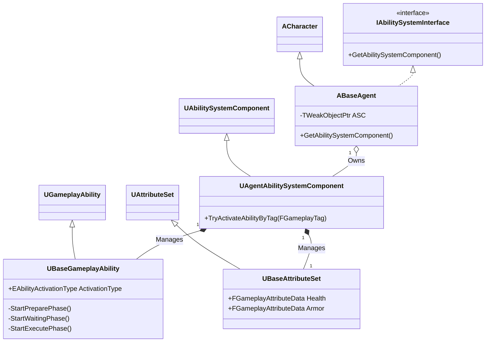
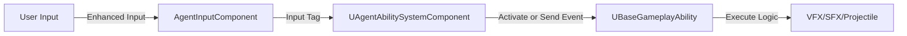
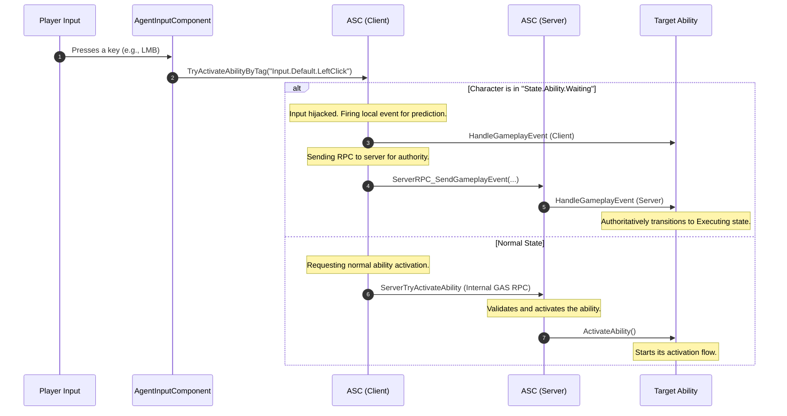

# 프로젝트 GAS 아키텍처 (Project GAS Architecture)

## 1. 설계 목표 및 근거 (Design Goals & Rationale)

이 프로젝트는 언리얼 엔진의 Gameplay Ability System (GAS)을 그대로 사용하지 않고, 프로젝트의 특성에 맞게 핵심 클래스들을 상속받아 확장하는 방식으로 설계되었습니다. 여기에는 다음과 같은 명확한 설계 목표가 있었습니다.

1.  **데이터 기반 설계 (Data-Driven Design)**: 새로운 요원을 추가하거나 스킬을 교체할 때, C++ 코드를 수정하는 것이 아니라 데이터 테이블(`UDataTable`)이나 데이터 에셋을 수정하는 것만으로 가능하도록 하는 것을 목표로 했습니다. 이를 위해 `UAgentAbilitySystemComponent`에 `InitializeByAgentData`와 같은 함수를 구현하여, 에이전트 ID만으로 관련된 모든 속성과 어빌리티를 자동으로 부여하도록 설계했습니다.

2.  **입력과 로직의 완전한 분리 (Decoupling Input from Logic)**: 플레이어의 키 입력(예: 'Q' 키)과 실제 실행되는 스킬(예: '피닉스 커브볼')의 관계를 하드코딩하지 않는 것을 목표로 했습니다. `GameplayTag`를 중간 다리로 사용하여, `UAgentInputComponent`는 단지 `Input.Skill.Q`라는 태그를 `UAgentAbilitySystemComponent`에 보낼 뿐입니다. 그러면 ASC가 현재 캐릭터가 가진 어빌리티 중 해당 태그가 부여된 것을 찾아 실행합니다. 이 덕분에 어떤 캐릭터든 `Input.Skill.Q` 태그를 가진 어빌리티를 장착하면 'Q' 키로 스킬을 사용할 수 있습니다.

3.  **중앙화된 데이터 및 반응형 업데이트 (Centralized Data & Reactive Updates)**: 캐릭터의 모든 핵심 수치(체력, 방어력 등)는 `UBaseAttributeSet`에서만 관리하도록 역할을 중앙화했습니다. 외부 시스템(특히 HUD)은 이 데이터를 직접 참조하는 대신, `AttributeSet`이 제공하는 델리게이트(`OnHealthChanged` 등)에 자신의 업데이트 함수를 바인딩합니다. 이를 통해 데이터가 변경될 때만 UI가 반응하여 업데이트되므로, 매 프레임 데이터를 체크하는 비효율적인 방식을 피하고 시스템 간의 의존성을 낮췄습니다.

## 2. 아키텍처 (Architecture)

본 프로젝트의 GAS 아키텍처는 `ABaseAgent`를 중심으로, 커스터마이징된 `UAgentAbilitySystemComponent`와 `UBaseAttributeSet`, 그리고 체계적으로 분류된 `GameplayTag`가 유기적으로 연결된 구조입니다.

### 2.1. 핵심 클래스 (Core Classes)

먼저 아키텍처를 구성하는 핵심 클래스들의 관계와 역할을 살펴보겠습니다.

#### 클래스 다이어그램 (Class Diagram)


#### 핵심 클래스 및 역할
*   **`ABaseAgent`** ([View on GitHub](https://github.com/chungheonLee0325/VALORANT/tree/main/UnrealEngine/Valorant/Source/Valorant/Player/Agent/BaseAgent.h)): 모든 플레이어 캐릭터의 부모 클래스입니다. `IAbilitySystemInterface`를 구현하며, 내부에 `AgentAbilitySystemComponent`와 `BaseAttributeSet`의 인스턴스를 소유하고 초기화하는 역할을 담당합니다.
*   **`UAgentAbilitySystemComponent`** ([View on GitHub](https://github.com/chungheonLee0325/VALORANT/tree/main/UnrealEngine/Valorant/Source/Valorant/AbilitySystem/AgentAbilitySystemComponent.h)): `UAbilitySystemComponent`를 상속받은 핵심 클래스입니다. 어빌리티 부여, 입력 태그를 통한 어빌리티 활성화(`TryActivateAbilityByTag`), 어빌리티 상태 관리 등 모든 GAS 관련 동작의 중앙 허브 역할을 합니다.
*   **`UBaseGameplayAbility`** ([View on GitHub](https://github.com/chungheonLee0325/VALORANT/tree/main/UnrealEngine/Valorant/Source/Valorant/AbilitySystem/Abilities/BaseGameplayAbility.h)): `UGameplayAbility`를 상속받아, 모든 스킬이 공통적으로 사용할 상태 머신(Prepare-Wait-Execute), 애니메이션 재생, 이펙트 출력 등의 기능을 미리 구현해놓은 기반 클래스입니다.
*   **`UBaseAttributeSet`** ([View on GitHub](https://github.com/chungheonLee0325/VALORANT/tree/main/UnrealEngine/Valorant/Source/Valorant/AbilitySystem/Attributes/BaseAttributeSet.h)): `UAttributeSet`을 상속하며, 모든 캐릭터가 공통으로 가질 체력(Health), 방어력(Armor) 등의 속성을 정의합니다. 속성 값의 변경을 감지하고, 변경 시 관련 로직(예: HUD 업데이트)을 처리하는 델리게이트를 포함합니다.

### 2.2. 데이터 흐름 및 상호작용 (Data Flow & Interaction)

클래스들이 실제로 어떻게 상호작용하며 데이터가 흐르는지 살펴보겠습니다.

#### 전체 시스템 흐름 (Overall System Flow)


#### 데이터 및 입력 라우팅 (Data & Input Routing)
입력은 `AgentInputComponent`에서 시작되어 태그 기반으로 ASC에 전달됩니다. ASC는 '지능형 라우터' 역할을 수행하며, 어빌리티의 현재 상태에 따라 입력을 후속 동작을 위한 `GameplayEvent`로 라우팅하거나, 태그에 맞는 새로운 어빌리티를 활성화합니다. 아래 다이어그램은 이 두 가지 분기 흐름을 보여줍니다.



### 2.3. 게임플레이 태그 활용 전략 (GameplayTag Strategy)

이 프로젝트는 `GameplayTag`를 단순한 식별자를 넘어, 시스템의 상태와 동작을 제어하는 핵심 도구로 사용합니다. 모든 태그는 `ValorantGameplayTags.h`에 싱글톤으로 정의되어 있으며, 다음과 같이 체계적으로 분류하여 관리합니다.

*   **상태 태그 (`State.*`)**: 캐릭터나 어빌리티의 현재 '상태'를 나타냅니다.
    *   `State.Ability.Preparing`: 어빌리티가 준비 중인 상태.
    *   `State.Debuff.Suppressed`: 제압 효과를 받아 스킬 사용이 불가능한 상태.
    *   `State.Flash.Blinded`: 섬광 효과에 당해 시야가 차단된 상태.

*   **입력 태그 (`Input.*`)**: 플레이어의 하드웨어 입력을 추상화하여 어빌리티와 연결합니다.
    *   `Input.Skill.Q`: 'Q' 스킬 키 입력을 나타냅니다.
    *   `Input.Default.LeftClick`: 마우스 좌클릭 입력을 나타냅니다.

*   **차단 태그 (`Block.*`)**: 특정 행동이 불가능함을 명시적으로 나타냅니다.
    *   `Block.Movement`: 이동이 불가능한 상태.
    *   `Block.WeaponSwitch`: 무기 교체가 불가능한 상태.

*   **데이터 태그 (`Data.*`)**: 어빌리티 스펙이나 이펙트에 메타데이터를 저장하는 용도로 사용됩니다.
    *   `Data.AbilityID`: 어빌리티 스펙에 해당 어빌리티의 고유 ID를 저장합니다.

이러한 체계적인 태그 분류는 복잡한 상호작용(예: '제압 상태일 때는 모든 스킬 입력을 무시한다')을 매우 직관적이고 효율적인 코드로 구현할 수 있게 만드는 기반이 됩니다.

## 3. 핵심 로직 분석 (Core Logic Analysis)

### 3.1. 공정한 스킬 취소 메커니즘

GameplayTag를 활용하여 어떻게 복잡한 문제를 해결하는지 보여주는 좋은 예시는 **'공정한 스킬 취소'** 메커니즘에서 찾아볼 수 있습니다.

플레이어는 스킬을 준비하는 도중에는 다른 행동(예: 무기 교체)으로 스킬을 취소할 수 있어야 합니다. 하지만 스킬의 핵심 동작이 이미 시작된 **실행(Executing) 단계**에서까지 취소가 허용된다면, 플레이어는 스킬 사용 후의 경직 시간(후딜레이)을 건너뛰는 **'후딜 캔슬'** 과 같은 꼼수를 사용해 불공정한 이점을 얻을 수 있습니다.

따라서 이 아키텍처는 GameplayTag를 이용해, 스킬이 '실행' 상태에 들어갔을 때만 취소를 막는 방식으로 이 문제를 해결했습니다.

1.  **`Executing` 상태에서만 차단 태그 부여**: `UBaseGameplayAbility`가 상태를 변경할 때 호출하는 `SetAbilityState` 함수 내부에, 새로운 상태가 `State.Ability.Executing`일 경우에만 캐릭터에게 `Block.WeaponSwitch` 태그를 부여하는 로직을 추가했습니다. `Preparing`이나 `Waiting` 상태에서는 이 태그가 부여되지 않습니다.
    [View on GitHub: BaseGameplayAbility.cpp#L487](https://github.com/chungheonLee0325/VALORANT/blob/main/UnrealEngine/Valorant/Source/Valorant/AbilitySystem/Abilities/BaseGameplayAbility.cpp#L487)
    ```cpp
    void UBaseGameplayAbility::SetAbilityState(const FGameplayTag& StateTag)
    {
        // ... (기존 상태 태그 제거)
        CachedASC->AddLooseGameplayTag(StateTag);
        
        // 무기 전환 차단 태그는 실행 중에만 부여
        if (StateTag == FValorantGameplayTags::Get().State_Ability_Executing)
        {
            CachedASC->AddLooseGameplayTag(FValorantGameplayTags::Get().Block_WeaponSwitch);
        }
        // ...
    }
    ```

2.  **무기 전환 시 차단 태그 검사**: 플레이어가 무기 전환을 시도하면 `ABaseAgent::SwitchEquipment` 함수가 호출됩니다. 이 함수는 실제 전환 로직을 실행하기 전에, 캐릭터가 `Block.WeaponSwitch` 태그를 가지고 있는지 먼저 확인합니다. 태그가 있다면, 함수는 즉시 종료되어 무기 전환을 막습니다.
    [View on GitHub: BaseAgent.cpp#795](https://github.com/chungheonLee0325/VALORANT/blob/main/UnrealEngine/Valorant/Source/Valorant/Player/Agent/BaseAgent.cpp#L795)
    ```cpp
    void ABaseAgent::SwitchEquipment(EInteractorType EquipmentType)
    {
        // ...
        if (ASC.IsValid())
        {
            // 무기 전환 차단 태그 체크
            if (ASC->HasMatchingGameplayTag(FValorantGameplayTags::Get().Block.WeaponSwitch))
            {
                return; // 차단됨
            }
            // 차단 태그가 없다면, 활성화된 어빌리티를 강제 취소
            ASC->ForceCleanupAllAbilities();
        }
        // ... (이후 무기 전환 로직 실행)
    }
    ```

이 구조를 통해, `Preparing` 또는 `Waiting` 상태의 스킬은 `Block.WeaponSwitch` 태그가 없으므로 언제든지 무기 전환으로 취소할 수 있으며, 이 경우 스킬 비용도 소모되지 않습니다. 반면, `Executing` 상태에 진입한 스킬은 `Block.WeaponSwitch` 태그로 보호되어 후딜 캔슬과 같은 악용을 원천적으로 차단할 수 있었습니다.

### 3.2. 데이터 기반 어빌리티 부여

`UAgentAbilitySystemComponent::SetAgentAbility` 함수는 이 아키텍처의 데이터 기반 설계와 입력-로직 분리 사상을 가장 잘 보여주는 코드입니다. 어빌리티를 부여할 때, 어빌리티 자체의 태그와 그것을 발동시킬 입력 태그를 동적으로 연결하고, 어빌리티의 고유 ID까지 스펙에 저장합니다.

[View on GitHub: AgentAbilitySystemComponent.cpp#L101](https://github.com/chungheonLee0325/VALORANT/blob/main/UnrealEngine/Valorant/Source/Valorant/AbilitySystem/AgentAbilitySystemComponent.cpp#L101)
```cpp
void UAgentAbilitySystemComponent::SetAgentAbility(int32 abilityID, int32 level)
{
    // ... (abilityData 및 어빌리티 에셋 로드)

    // 스킬 슬롯 태그(Input.Skill.Q 등)가 있는지 확인하여 skillTag에 저장
    for (const FGameplayTag& tag : tagCon)
    {
        if (SkillTags.Contains(tag))
        {
            skillTag = tag;
            bIsSkill = true;
            break;
        }
    }

    // ... (bIsSkill 체크)

    // 어빌리티 스펙을 생성하고, 여기에 입력 태그를 동적으로 주입
    FGameplayAbilitySpec spec(abilityClass, level);
    spec.GetDynamicSpecSourceTags().AddTag(skillTag);
    
    // 어빌리티 ID를 스펙에 저장 (나중에 GetAbilityDataBySlot에서 조회할 때 사용)
    spec.SetByCallerTagMagnitudes.Add(FGameplayTag::RequestGameplayTag("Data.AbilityID"), abilityID);
    
    GiveAbility(spec);
}
```
*   **의도**: 이 로직 덕분에, `피닉스_커브볼` 어빌리티 에셋에 `Input.Skill.Q` 태그를 추가해두기만 하면, `SetAgentAbility` 함수가 자동으로 'Q' 키 입력과 이 어빌리티를 연결해줍니다. 또한, `SetByCallerTagMagnitudes`를 통해 스펙 자체에 어빌리티 ID를 저장해둠으로써, 나중에 HUD 등에서 스킬 정보를 조회할 때 복잡한 과정 없이 스펙만으로 원본 데이터에 접근할 수 있습니다.

### 3.3. 속성 변경 감지 및 전파

`UBaseAttributeSet`의 `OnRep_Health` 함수는 서버에서 변경된 체력 값이 어떻게 클라이언트의 UI에까지 안전하게 전달되는지를 보여줍니다. 이 간단한 함수가 반응형 UI 업데이트의 핵심입니다.

[View on GitHub: BaseAttributeSet.cpp#L155](https://github.com/chungheonLee0325/VALORANT/blob/main/UnrealEngine/Valorant/Source/Valorant/AbilitySystem/Attributes/BaseAttributeSet.cpp#L155)
```cpp
void UBaseAttributeSet::GetLifetimeReplicatedProps(TArray<FLifetimeProperty>& OutLifetimeProps) const
{
    Super::GetLifetimeReplicatedProps(OutLifetimeProps);
    // Health 속성이 서버에서 변경되면, OnRep_Health 함수를 클라이언트에서 호출하도록 설정
    DOREPLIFETIME_CONDITION_NOTIFY(UBaseAttributeSet, Health, COND_None, REPNOTIFY_Always);
}

void UBaseAttributeSet::OnRep_Health(const FGameplayAttributeData& OldHealth)
{
    // 서버로부터 복제된 새 Health 값을 사용하여, 클라이언트의 델리게이트를 브로드캐스트함
    OnHealthChanged.Broadcast(Health.GetCurrentValue(), CachedWasDamaged);
}
```
*   **의도**: 서버에서 플레이어가 피해를 입어 `Health` 속성 값이 변경되면, 이 값은 언리얼 엔진의 리플리케이션 시스템에 의해 모든 클라이언트로 복제됩니다. 클라이언트에서 복제가 완료되는 순간 `OnRep_Health` 함수가 자동으로 호출되고, 이 함수는 `OnHealthChanged` 델리게이트를 실행시킵니다. HUD 위젯은 이 델리게이트에 자신의 UI 업데이트 함수를 미리 바인딩해두었기 때문에, 최종적으로 화면의 체력 바가 갱신됩니다. 이 과정을 통해 데이터의 흐름이 서버 -> 클라이언트 -> UI로 명확하고 안정적으로 이어집니다.

## 4. 관련 시스템 (Related Systems)

*   **[어빌리티 기반 클래스와 활성화 흐름](./1.3_Skill-Implementation.md)**: 이 아키텍처 위에서 실제 어빌리티들이 어떻게 동작하는지에 대한 상세 설명입니다.
*   **[Input 및 HUD와 ASC 연동](./1.5_Input_HUD_ASC.md)**: 이 아키텍처의 데이터를 소비하여 플레이어에게 입력을 받고 시각적 피드백을 제공하는 시스템입니다.
*   **[확장 가능한 스킬 대량 구현](./1.4_Scalable-Skill-Production.md)**: 이 아키텍처가 어떻게 다수의 스킬을 효율적으로 생산할 수 있게 했는지 보여주는 문서입니다.
