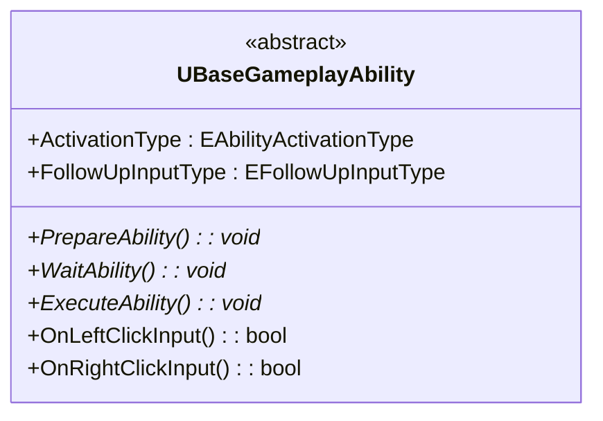
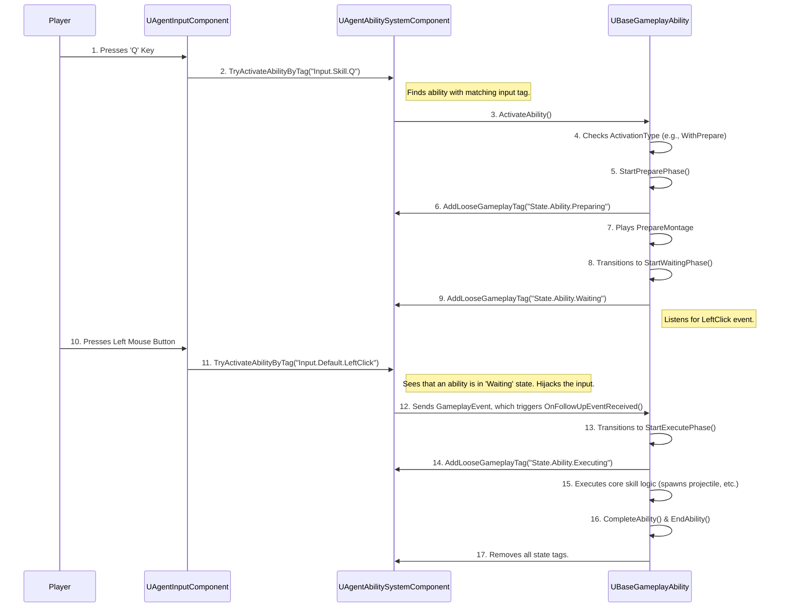

# 어빌리티 기반 클래스와 활성화 흐름

이전 아키텍처 문서에서 설명한 구조 위에서, 모든 스킬의 실질적인 동작을 책임지는 `UBaseGameplayAbility` 클래스와, 플레이어의 입력이 실제 스킬 실행으로 이어지는 전체 데이터 흐름을 상세히 분석합니다.

## 1. UBaseGameplayAbility 심층 분석 ([View on GitHub](https://github.com/chungheonLee0325/VALORANT/tree/main/UnrealEngine/Valorant/Source/Valorant/AbilitySystem/Abilities/BaseGameplayAbility.h))

`UBaseGameplayAbility`는 이 프로젝트의 모든 스킬(12종 이상)이 상속받는 부모 클래스입니다. 이 클래스는 스킬 구현에 필요한 공통적인 기능들을 추상화하여 제공하며, 특히 **3단계 상태 머신**은 이 클래스의 핵심적인 설계 사상입니다.

### 핵심 구조 및 API (Core Structure & API)

`UBaseGameplayAbility`의 핵심 구조는 다음과 같이 표현할 수 있습니다. 모든 파생 스킬은 이 클래스가 제공하는 상태 전이 함수와 입력 처리 함수를 오버라이드하여 고유한 동작을 구현합니다.



```cpp
// 활성화/후속입력 타입과 단계 전이 핵심 API
UENUM(BlueprintType)
enum class EAbilityActivationType : uint8 { Instant, WithPrepare };
UENUM(BlueprintType)
enum class EFollowUpInputType : uint8 { None, LeftClick, RightClick, LeftOrRight };

void StartPreparePhase();
void StartWaitingPhase();
void StartExecutePhase(EFollowUpInputType InputType = EFollowUpInputType::None);

// 파생 클래스에서 오버라이드하여 사용하는 가상 함수들
virtual bool OnLeftClickInput();
virtual bool OnRightClickInput();
virtual void PrepareAbility();
virtual void WaitAbility();
virtual void ExecuteAbility();
```

### 3단계 상태 머신 (3-Stage State Machine)

모든 스킬은 내부적으로 `Preparing` -> `Waiting` -> `Executing`의 3단계 상태를 가질 수 있으며, 각 상태는 다음과 같은 역할을 합니다.

*   **`State.Ability.Preparing`**: 스킬이 발동되기 전의 준비 단계입니다. 주로 조준 UI를 표시하거나, 스킬 시전을 위한 선행 애니메이션을 재생합니다. 이 상태에서는 언제든지 스킬을 취소할 수 있습니다.
*   **`State.Ability.Waiting`**: 준비 단계가 끝난 후, 플레이어의 추가적인 입력(예: 마우스 좌클릭/우클릭)을 기다리는 상태입니다. 이 상태에서는 일정 시간이 지나면 자동으로 스킬이 취소되는 타임아웃 로직이 있습니다.
*   **`State.Ability.Executing`**: 실제 스킬의 핵심 로직이 실행되는 단계입니다. 이 상태에 진입하면 스킬 스택이 소모되고, 쿨다운이 적용되며, 투사체를 발사하거나 즉시 효과를 적용하는 등의 동작이 이루어집니다. 이 상태에서는 기본적으로 다른 행동으로 스킬을 취소할 수 없습니다.

### 활성화 타입 (Activation Type)

`UBaseGameplayAbility`는 `EAbilityActivationType`이라는 열거형 변수를 통해 스킬이 어떤 방식으로 상태 머신을 시작할지 결정합니다.

*   **`EAbilityActivationType::Instant`**: 스킬 키를 누르는 즉시 `Executing` 상태로 진입합니다. (예: 제트의 순풍)
*   **`EAbilityActivationType::WithPrepare`**: 스킬 키를 누르면 `Preparing` 상태부터 순서대로 상태 머신을 시작합니다. (예: 피닉스의 불길)

## 2. 스킬 활성화 타입별 구현 예시

이 상태 머신과 활성화 타입 덕분에, 대부분의 스킬은 단지 `UBaseGameplayAbility`를 상속받는 블루프린트를 만들고, 타입과 애셋(애니메이션, 파티클 등)만 지정해주면 새로운 C++ 코드 없이도 구현이 가능했습니다.

### Instant 타입 예시: 제트의 '상승기류' ([View on GitHub](https://github.com/chungheonLee0325/VALORANT/blob/main/UnrealEngine/Valorant/Source/Valorant/AbilitySystem/Abilities/Jett/Jett_Q_Updraft.cpp#L16))

제트의 상승기류(Q 스킬)는 키를 누르면 즉시 캐릭터를 위로 띄우는 스킬입니다.

*   **`ActivationType`**: `Instant`
*   **`ExecuteMontage`**: 상승기류를 사용하는 1인칭/3인칭 몽타주
*   **`ExecuteAbility` (오버라이드)**: `LaunchCharacter` 함수로 캐릭터를 위로 띄우는 동시에, 일시적으로 중력(`GravityScale`)과 공중 마찰력(`BrakingDecelerationFalling`)을 높였다가 짧은 시간 후에 원래 값으로 복원합니다. 이 추가적인 조정은 스킬 사용 후 캐릭터가 너무 오래 공중에 떠 있지 않고 빠르게 지상에 복귀하도록 하여, 게임의 템포와 조작감을 향상시키는 중요한 역할을 합니다.

### WithPrepare 타입 예시: 피닉스의 '불길' ([View on GitHub](https://github.com/chungheonLee0325/VALORANT/blob/main/UnrealEngine/Valorant/Source/Valorant/AbilitySystem/Abilities/Phoenix/Phoenix_C_Blaze.cpp#L18))

피닉스의 불길(C 스킬)은 스킬 키를 눌러 준비 자세를 취하고(`Preparing`), 이후 마우스 입력에 따라 다른 형태의 불길 벽을 생성하는 스킬입니다.

*   **`ActivationType`**: `WithPrepare`
*   **`FollowUpInputType`**: `LeftOrRight` (좌클릭 또는 우클릭 입력을 기다림)
*   **`PrepareMontage`**: 불길을 손에 드는 몽타주
*   **`OnLeftClickInput` / `OnRightClickInput` (오버라이드)**: 좌클릭 시에는 전방으로 직선의 불길 벽을 생성하는 투사체를, 우클릭 시에는 시야 방향으로 휘어지는 곡선의 불길 벽을 생성하는 투사체를 각각 스폰하도록 구현합니다. 이처럼 후속 입력에 따라 다른 로직을 실행하는 방식으로 복잡한 스킬을 구현합니다.

## 3. 전체 활성화 흐름 (The Complete Activation Flow)

플레이어의 키 입력 하나가 실제 스킬 실행으로 이어지기까지, 데이터는 다음과 같은 정교한 파이프라인을 통해 흐릅니다.



## 4. 문제 해결

### 후속 입력(Follow-up Input)의 안정적인 처리
*   **문제**: `WithPrepare` 타입의 스킬에서, `Waiting` 상태일 때 마우스 클릭과 같은 후속 입력을 받아 처리하는 과정이 불안정했습니다. 예를 들어, 입력을 너무 빨리하면 씹히거나, 특정 상황에서 이벤트가 전달되지 않는 문제가 있었습니다.
*   **원인**: 초기에는 `Tick` 함수에서 `IsInputPressed`와 같은 함수로 직접 입력을 체크하려고 시도했습니다. 이 방식은 프레임에 따라 입력을 놓칠 수 있고, 다른 어빌리티와의 상호작용을 고려하기 어려워 매우 불안정했습니다.
*   **해결 과정**:
    1.  **입력 전달 표준화**: `UAgentInputComponent`의 역할은 입력을 받아 ASC에 전달하는 것으로 단순화되었습니다. 예를 들어, `StartFire` 함수는 발사 로직을 직접 호출하는 대신, `ASC->TryActivateAbilityByTag(LeftClickTag)`를 호출하여 '좌클릭 입력이 발생했음'을 알립니다. ([View on GitHub: AgentInputComponent.cpp#L181](https://github.com/chungheonLee0325/VALORANT/tree/main/UnrealEngine/Valorant/Source/Valorant/Player/Component/AgentInputComponent.cpp#L181))
    2.  **지능적 입력 라우팅 (ASC)**: 실제 입력 하이재킹 로직은 **`UAgentAbilitySystemComponent`** 에 구현되었습니다. 커스터마이징된 `TryActivateAbilityByTag` 함수는 먼저 캐릭터가 후속 입력을 기다리는 `State.Ability.Waiting` 상태인지 확인합니다. ([View on GitHub: AgentAbilitySystemComponent.cpp#L204](https://github.com/chungheonLee0325/VALORANT/blob/main/UnrealEngine/Valorant/Source/Valorant/AbilitySystem/AgentAbilitySystemComponent.cpp#L204))
    3.  **이벤트 변환 및 전달**: `Waiting` 상태가 맞다면, `TryActivateAbilityByTag`는 새로운 어빌리티를 활성화하는 대신, 들어온 입력 태그를 `GameplayEvent`로 변환하여 현재 대기 중인 어빌리티에게 전달합니다.
    4.  **이벤트 대기 및 수신**: `UBaseGameplayAbility`의 `StartWaitingPhase` 함수는 `AbilityTask_WaitGameplayEvent`를 생성하여 이 `GameplayEvent`를 기다립니다. 이벤트가 수신되면 `OnFollowUpEventReceived` 델리게이트가 호출되어 `StartExecutePhase`로 상태를 전환합니다. ([View on GitHub: BaseGameplayAbility.cpp#L225](https://github.com/chungheonLee0325/VALORANT/blob/main/UnrealEngine/Valorant/Source/Valorant/AbilitySystem/Abilities/BaseGameplayAbility.cpp#L225))
*   **교훈**: 복잡한 입력 처리 로직을 `UAgentAbilitySystemComponent`에 중앙 집중화함으로써, `UAgentInputComponent`는 입력 신호를 보내는 역할에만 충실할 수 있게 되었습니다. ASC를 '지능형 입력 라우터'로 활용함으로써, 복잡한 스킬 메커니즘을 명확하고 확장 가능하게 구현할 수 있었습니다.

### 상태이상을 이용한 스킬 차단: '제압(Suppression)' 구현
*   **문제**: KAY/O의 'ZERO/point' 스킬처럼, 특정 상태이상에 걸린 적이 모든 스킬을 사용하지 못하게 만들어야 했습니다. 각 스킬마다 개별적으로 "내가 제압 상태인가?"를 체크하는 코드를 넣는 것은 비효율적이고 확장성을 해치는 방식이었습니다.
*   **해결: `ActivationBlockedTags`의 활용**: 이 문제는 GAS의 내장 기능인 `ActivationBlockedTags`를 통해 매우 우아하게 해결했습니다. `UBaseGameplayAbility`의 생성자에서, 모든 스킬의 활성화를 막는 태그로 `State.Debuff.Suppressed`를 미리 등록해두었습니다.
    [View on GitHub: BaseGameplayAbility.cpp#L14](https://github.com/chungheonLee0325/VALORANT/blob/main/UnrealEngine/Valorant/Source/Valorant/AbilitySystem/Abilities/BaseGameplayAbility.cpp#L14)
    ```cpp
    // In UBaseGameplayAbility::UBaseGameplayAbility()
    UBaseGameplayAbility::UBaseGameplayAbility()
    {
        // ...
        // 이 어빌리티는 "State.Debuff.Suppressed" 태그가 있으면 활성화될 수 없음
        ActivationBlockedTags.AddTag(FGameplayTag::RequestGameplayTag(FName("State.Debuff.Suppressed")));
    }
    ```
*   **결과**: KAY/O의 스킬이 적에게 `GameplayEffect`를 통해 `State.Debuff.Suppressed` 태그를 부여하면, GAS는 어떤 스킬이든 활성화하려고 할 때(`CanActivateAbility` 호출 시) 자동으로 해당 캐릭터가 이 차단 태그를 가지고 있는지 검사합니다. 태그가 있다면, 어빌리티는 활성화되지 않습니다. 이 덕분에, **모든 파생 스킬들은 단 한 줄의 코드 수정 없이도** '제압' 상태이상을 자동으로 지원하게 되었습니다. 또한, 제압 효과를 받은 캐릭터의 `AbilitySystemComponent`에 `CancelAbilities` 함수를 호출하여, 이미 사용 중인 스킬까지 강제로 취소시키는 로직을 추가하여 완벽한 제압 기능을 구현했습니다.
*   **교훈**: GAS의 `GameplayTag`는 단순한 식별자를 넘어, 시스템 전역에서 상태를 공유하고 로직을 제어하는 매우 강력한 도구임을 다시 한번 확인했습니다. 특히 `ActivationBlockedTags`와 같은 내장 기능을 활용하면, 복잡한 상태이상 로직을 매우 효율적이고 확장성 있게 구현할 수 있습니다.


## 5. 관련 시스템 (Related Systems)

*   **[GAS 아키텍처](./1.2_Project-GAS-Architecture.md)**: 이 문서에서 설명하는 `UBaseGameplayAbility`는 해당 아키텍처의 핵심 구성 요소입니다.
*   **[확장 가능한 스킬 대량 구현](./1.4_Scalable-Skill-Production.md)**: 이 `UBaseGameplayAbility` 클래스가 어떻게 12가지가 넘는 스킬을 효율적으로 생산하는 기반이 되었는지 설명합니다.
