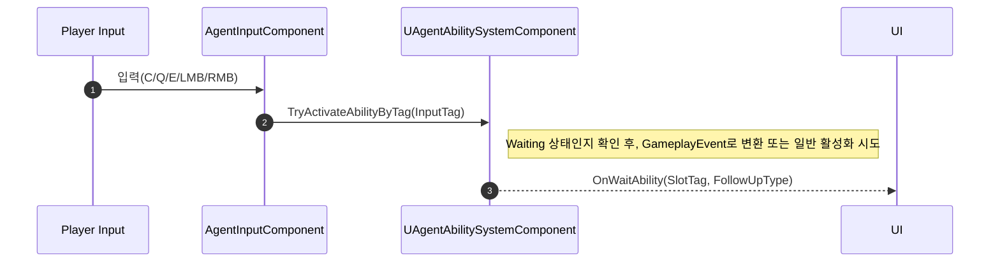

# 입력(Input), HUD, 능력 시스템(ASC)의 연동

## 1. 설계 목표 및 근거

플레이어 입력, 헤드업 디스플레이(HUD), 그리고 게임플레이 어빌리티 시스템(GAS) 컴포넌트(ASC) 간의 통합은 다음과 같은 핵심 목표로 설계되었습니다:

1.  **게임플레이 태그를 통한 디커플링**: 입력 처리 로직은 어빌리티 활성화 로직과 완전히 분리되어 있습니다. 입력 컴포넌트는 *어떤* 스킬을 활성화하는지 알지 못하며, 단지 `GameplayTag`를 사용하여 일반적인 신호(예: "어빌리티 1 키 눌림")만 보냅니다. `AbilitySystemComponent`가 이 태그를 해석하고 해당 어빌리티를 활성화하는 역할을 담당합니다. 이를 통해 C++ 코드를 변경하지 않고도 키와 어빌리티를 쉽게 재매핑할 수 있습니다.

2.  **중앙화된 데이터 허브(ASC)**: `AbilitySystemComponent`는 속성(체력, 아머)과 어빌리티 상태(쿨다운, 스택) 등 모든 게임플레이 관련 플레이어 데이터의 유일한 진실의 원천 역할을 합니다. HUD의 역할은 순수하게 이 데이터를 *시각화*하는 것이며, 상태를 저장하거나 관리하지 않습니다.

3.  **이벤트 기반 UI 업데이트**: HUD는 ASC의 변경사항에 반응적으로 업데이트됩니다. 매 프레임마다 데이터 변경을 확인하는(틱) 대신, HUD는 `PlayerController`와 `PlayerState`의 델리게이트에 업데이트 함수를 바인딩합니다. 서버에서 속성이나 어빌리티 스택이 변경되고 복제되면, 이러한 델리게이트가 브로드캐스트되어 자동으로 UI 업데이트를 트리거합니다. 이는 훨씬 더 효율적이며 UI가 항상 권한 있는 게임 상태와 동기화되도록 보장합니다.

## 2. 기술적 문제 및 해결책: 어빌리티 준비 상태에서의 입력 하이재킹

*   **문제**: 피닉스의 '커브볼'이나 세이지의 '장벽 구슬'처럼, 스킬 키를 눌러 준비 상태(`WithPrepare`)에 들어간 후, 마우스 좌클릭/우클릭으로 후속 동작을 발동하는 스킬들이 있습니다. 평소에 마우스 클릭은 '총기 발사'와 '조준'에 사용되지만, 이 특정 상태 동안에는 해당 입력을 가로채(Hijack) 스킬의 고유한 동작(예: 왼쪽으로 던지기/오른쪽으로 던지기)에 사용해야 했습니다. 어떻게 이처럼 동적으로 입력의 의미를 전환할 수 있을까요?

*   **해결책**: **`UAgentInputComponent`**와 **`UAgentAbilitySystemComponent`**의 긴밀한 협력을 통해 해결했습니다. 입력 컴포넌트는 입력을 받았을 때 무조건 특정 행동을 호출하는 대신, 모든 입력을 `GameplayTag`와 함께 ASC로 전달하는 역할만 수행합니다.

    1.  **입력 전달**: `UAgentInputComponent`의 `StartFire` 함수는 일반 발사 로직을 직접 호출하는 대신, `ASC->TryActivateAbilityByTag(LeftClickTag)`를 호출하여 '좌클릭 입력이 발생했음'을 알립니다.
    2.  **지능적 입력 라우팅**: 커스터마이징된 `UAgentAbilitySystemComponent`의 `TryActivateAbilityByTag` 함수는 컨트롤 타워 역할을 합니다. 이 함수는 먼저 캐릭터가 후속 입력을 기다리는 `State.Ability.Waiting` 상태인지 확인합니다.
    3.  **입력 하이재킹 (이벤트 변환)**: 만약 `Waiting` 상태가 맞다면, `TryActivateAbilityByTag`는 새로운 어빌리티를 활성화하는 대신, 들어온 입력 태그를 `GameplayEvent`로 변환하여 현재 대기 중인 어빌리티에게 전달합니다.
    4.  **일반 동작 실행**: 만약 `Waiting` 상태가 아니라면, `TryActivateAbilityByTag`는 실패하고, 그제서야 `StartFire` 함수 내의 다음 로직인 일반 무기 발사(`Agent->StartFire()`)가 실행됩니다.

*   **교훈**: 이 구조를 통해 입력 처리를 중앙(`UAgentInputComponent`)에서 단순화하고, 실제 입력의 의미를 결정하는 복잡한 로직은 모두 `UAgentAbilitySystemComponent`에 위임할 수 있었습니다. ASC를 '지능형 라우터'로 활용함으로써, 복잡한 스킬 메커니즘을 명확하고 확장 가능하게 구현할 수 있었습니다.

## 3. 아키텍처 개요

입력, ASC, HUD 간의 상호작용은 아래와 같이 요약할 수 있습니다. 플레이어의 입력은 `AgentInputComponent`를 통해 ASC로 전달되고, ASC는 어빌리티의 상태 변화를 다시 HUD에 알려 UI를 업데이트합니다.



## 4. 핵심 로직 분석

### 전체 흐름: 입력 바인딩부터 HUD 업데이트까지

1.  **입력 바인딩 (`UAgentInputComponent`)**: Enhanced Input의 `UInputAction`을 특정 처리 함수에 연결합니다.

    [View on GitHub: AgentInputComponent.cpp#L59](https://github.com/chungheonLee0325/VALORANT/blob/main/UnrealEngine/Valorant/Source/Valorant/Player/Component/AgentInputComponent.cpp#L59)
    ```cpp
    void UAgentInputComponent::BindInput(UInputComponent* InputComponent)
    {
        if (auto* eic = Cast<UEnhancedInputComponent>(InputComponent))
        {
            eic->BindAction(LeftMouseStartAction, ETriggerEvent::Triggered, this, &UAgentInputComponent::StartFire);
        }
    }
    ```

2.  **지능적 입력 라우팅 (`UAgentAbilitySystemComponent`)**: `StartFire` 함수는 `TryActivateAbilityByTag`를 호출하고, 실제 라우팅은 ASC 내부에서 이루어집니다.

    [View on GitHub: AgentAbilitySystemComponent.cpp#L204](https://github.com/chungheonLee0325/VALORANT/blob/main/UnrealEngine/Valorant/Source/Valorant/AbilitySystem/AgentAbilitySystemComponent.cpp#L204)
    ```cpp
    bool UAgentAbilitySystemComponent::TryActivateAbilityByTag(const FGameplayTag& InputTag)
    {
        // 1. 후속 입력을 기다리는 상태인지 먼저 확인
        if (HasMatchingGameplayTag(FValorantGameplayTags::Get().State_Ability_Waiting))
        {
            // 2. 그렇다면, 입력 이벤트를 어빌리티로 전달
            FGameplayEventData EventData; EventData.EventTag = InputTag;
            HandleGameplayEvent(InputTag, &EventData);
            return true;
        }
        // 3. 아니라면, 일반적인 어빌리티 활성화를 시도
        return TryActivateAbilitiesByTag(InputTag);
    }
    ```

3.  **이벤트 대기 및 수신 (`UBaseGameplayAbility`)**: 어빌리티는 `Waiting` 상태에서 `WaitGameplayEvent` 태스크를 통해 이벤트를 기다립니다.

    [View on GitHub: BaseGameplayAbility.cpp#L140](https://github.com/chungheonLee0325/VALORANT/blob/main/UnrealEngine/Valorant/Source/Valorant/AbilitySystem/Abilities/BaseGameplayAbility.cpp#L140)
    ```cpp
    void UBaseGameplayAbility::StartWaitingPhase()
    {
        UAbilityTask_WaitGameplayEvent* WaitEventTask = UAbilityTask_WaitGameplayEvent::WaitGameplayEvent(this, FValorantGameplayTags::Get().InputTag_Default_LeftClick);
        WaitEventTask->EventReceived.AddDynamic(this, &UBaseGameplayAbility::OnFollowUpEventReceived);
        WaitEventTask->ReadyForActivation();
    }

    void UBaseGameplayAbility::OnFollowUpEventReceived(FGameplayEventData Payload)
    {
        if (OnLeftClickInput()) { StartExecutePhase(EFollowUpInputType::LeftClick); }
    }
    ```

4.  **HUD UI 표시 및 숨기기 (`UBaseGameplayAbility` -> `ABaseAgent`)**: 어빌리티는 자신의 상태 변화를 델리게이트로 외부에 알립니다.

    [View on GitHub: BaseGameplayAbility.cpp#L140](https://github.com/chungheonLee0325/VALORANT/blob/main/UnrealEngine/Valorant/Source/Valorant/AbilitySystem/Abilities/BaseGameplayAbility.cpp#L140) / [BaseAgent.cpp#L1411](https://github.com/chungheonLee0325/VALORANT/blob/main/UnrealEngine/Valorant/Source/Valorant/Player/Agent/BaseAgent.cpp#L1411)
    ```cpp
    // In UBaseGameplayAbility::StartWaitingPhase()
    OnWaitAbility.Broadcast(inputTag, FollowUpInputType); // UI 표시 요청

    // In UBaseGameplayAbility::StartExecutePhase()
    OnFollowUpInput.Broadcast(); // UI 숨김 요청

    // In ABaseAgent.cpp
    void ABaseAgent::OnAbilityPrepare(...)
    {
        MatchMapHud->DisplayFollowUpInputUI(...);
    }
    ```
*   **의도**: 어빌리티는 HUD의 존재를 직접 알 필요가 없습니다. 단지 자신의 상태 변화(`Waiting` 진입)와 필요한 입력 타입(`FollowUpInputType`)을 외부에 알릴 뿐입니다. `ABaseAgent`가 중간 다리 역할을 하여 이 정보를 HUD에 전달함으로써, 각 클래스는 자신의 책임만 다하는 명확한 단일 책임 원칙을 지키게 됩니다.

## 5. 관련 시스템

*   **[스킬 상세 구현](./1.3_Skill-Implementation.md)**: 이 문서에서 설명하는 입력 하이재킹 및 델리게이트는 `UBaseGameplayAbility`의 상태 머신과 직접적으로 연관됩니다.
*   **[확장 가능한 스킬 대량 생산](./1.4_Scalable-Skill-Production.md)**: `WithPrepare` 타입을 가진 대부분의 스킬이 이 입력 하이재킹 메커니즘을 활용하여 구현되었습니다.
