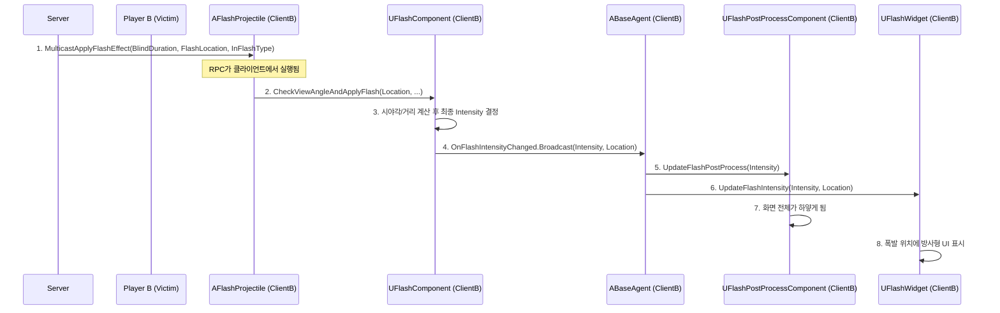

# Flash 시스템

## 1. 설계 목표 및 근거 (Design Goals & Rationale)

Flash(섬광) 시스템은 플레이어의 시야를 방해하는 핵심적인 군중 제어(CC) 기능으로, 설계 시 다음 목표에 중점을 두었습니다.

1.  **정교한 판정 로직**: 단순히 화면을 하얗게 만드는 것을 넘어, 섬광탄과의 거리, 시야각, 그리고 중간 장애물 여부를 모두 계산하여 섬광 효과의 강도와 지속 시간을 다르게 적용하는 것을 목표로 했습니다. 이를 통해 플레이어가 섬광탄에 대처할 수 있는 여지를 만들어 더 깊이 있는 게임플레이를 유도했습니다.

2.  **복합적 시각 효과를 통한 몰입감 증대**: 화면 전체를 덮는 포스트 프로세스 효과와, 섬광의 근원지 방향을 시각적으로 알려주는 방사형 UMG 위젯을 결합했습니다. 이를 통해 플레이어는 단순히 눈이 먼 상태가 아니라, 어느 방향에서 섬광이 터졌는지 직관적으로 인지할 수 있어 훨씬 더 현실감 있고 몰입감 높은 경험을 하게 됩니다.

3.  **역할 분리를 통한 확장성**: 섬광 효과를 유발하는 액터(`AFlashProjectile`), 효과의 강도를 계산하는 로직(`UFlashComponent`), 그리고 실제 화면 효과를 렌더링하는 부분(`UFlashPostProcessComponent`, `UFlashWidget`)의 역할을 명확히 분리했습니다. 이를 통해, 피닉스의 커브볼처럼 휘어지는 섬광탄이나 케이/오의 직선 섬광탄 등 각기 다른 투사체 로직을 가지는 스킬을 개발할 때, 핵심 판정 및 렌더링 로직을 재사용하여 쉽게 확장할 수 있도록 설계했습니다.

## 2. 아키텍처 (Architecture)

Flash 시스템은 `AFlashProjectile`이 폭발하며 자신의 위치 정보를 멀티캐스트 RPC로 전파하는 것으로 시작됩니다. 각 클라이언트는 이 정보를 받아 로컬 플레이어에게만 독립적으로 시각 효과를 적용합니다.

### 핵심 클래스 및 컴포넌트

*   **`AFlashProjectile`** ([View on GitHub](https://github.com/chungheonLee0325/VALORANT/tree/main/UnrealEngine/Valorant/Source/Valorant/AgentAbility/FlashProjectile.h)): 섬광탄 액터입니다. 서버에서 폭발 시, 자신의 위치(`FlashLocation`), 실명 시간(`BlindDuration`), 섬광 타입(`FlashType`)을 담아 `MulticastApplyFlashEffect` RPC를 모든 클라이언트에게 전파합니다.
*   **`UFlashComponent`** ([View on GitHub](https://github.com/chungheonLee0325/VALORANT/tree/main/UnrealEngine/Valorant/Source/Valorant/Player/Component/FlashComponent.h)): `ABaseAgent`에 부착됩니다. 로컬 플레이어의 `FlashComponent`는 RPC를 통해 전달받은 `FlashLocation`과 자신의 카메라 시야각을 계산하여 최종 섬광 강도(Intensity)를 결정하고, `OnFlashIntensityChanged` 델리게이트를 통해 **원본 `FlashLocation`과 계산된 `Intensity`를 함께** 외부에 알립니다.
*   **`ABaseAgent`**: 델리게이트의 중재자 역할을 합니다. `OnFlashIntensityChanged`를 수신하면, `Intensity`는 `UFlashPostProcessComponent`에, `Intensity`와 `FlashLocation`은 `UFlashWidget`에 각각 전달하여 실제 시각 효과를 트리거합니다.
*   **`UFlashPostProcessComponent`** ([View on GitHub](https://github.com/chungheonLee0325/VALORANT/tree/main/UnrealEngine/Valorant/Source/Valorant/Player/Component/FlashPostProcessComponent.h)): `ABaseAgent`에 부착됩니다. 전달받은 강도 값에 따라 카메라의 포스트 프로세스 머티리얼 파라미터를 조절하여 화면 전체의 밝기, 채도 등을 제어합니다.
*   **`UFlashWidget`** ([View on GitHub](https://github.com/chungheonLee0325/VALORANT/tree/main/UnrealEngine/Valorant/Source/Valorant/UI/FlashWidget.h)): 모든 플레이어의 화면에 추가되는 UMG 위젯입니다. 전달받은 폭발 위치를 화면 좌표로 변환하여, 해당 위치에 방사형 블러(Radial Blur) 이미지를 표시함으로써 섬광의 방향성을 시각적으로 제시합니다.

### 시퀀스 다이어그램 (Mermaid.js)



## 3. 핵심 로직 분석 (Core Logic)

### 데이터 파이프라인: `FlashSourceLocation`은 어떻게 위젯까지 전달되는가?

1.  **전파 (`AFlashProjectile`)**: 서버에서 폭발한 투사체는 자신의 위치를 담아 모든 클라이언트에게 멀티캐스트 RPC를 보냅니다. ([Code](https://github.com/chungheonLee0325/VALORANT/blob/main/UnrealEngine/Valorant/Source/Valorant/AgentAbility/FlashProjectile.cpp#L73))
2.  **수신 및 전달 (`AFlashProjectile` -> `UFlashComponent`)**: 클라이언트에서 실행된 RPC는 로컬 플레이어의 `UFlashComponent`를 찾아, 전달받은 `FlashLocation`을 그대로 넘겨줍니다. ([Code](https://github.com/chungheonLee0325/VALORANT/tree/main/UnrealEngine/Valorant/Source/Valorant/AgentAbility/FlashProjectile.cpp#L160))
3.  **계산 및 재전파 (`UFlashComponent` -> `ABaseAgent`)**: `UFlashComponent`는 시야각을 계산하여 최종 강도를 결정한 후, 자신이 받았던 `FlashLocation`과 함께 델리게이트로 다시 외부에 알립니다.
4.  **최종 분배 (`ABaseAgent` -> UI)**: `ABaseAgent`는 델리게이트를 받아 `UFlashWidget`의 `UpdateFlashIntensity` 함수를 호출하며, `FlashLocation` 데이터를 최종적으로 전달합니다. ([Code](https://github.com/chungheonLee0325/VALORANT/tree/main/UnrealEngine/Valorant/Source/Valorant/UI/FlashWidget.cpp#L65))

### 시각 효과의 디테일: 회복 곡선과 최소 효과

단순히 강도를 선형적으로 감소시키는 대신, 더 나은 게임플레이 경험을 위해 다음과 같은 디테일을 추가했습니다.

*   **비선형 회복 곡선**: 섬광 효과가 최고조에 달한 후, `CurrentFlashIntensity = pow(1 - t, 2.0)` 공식을 사용하여 강도를 업데이트합니다. `pow` 함수 덕분에 효과의 강도는 초반에 급격히 감소하고 후반에 완만하게 사라집니다. 이는 플레이어가 실명 상태에서 더 빨리 벗어나 게임에 복귀할 수 있도록 하여, 답답함을 줄이고 게임의 템포를 유지하는 역할을 합니다.
*   **최소 효과 보장**: 플레이어가 섬광탄을 완전히 등지거나 시야각에서 벗어나더라도, `MinimumFlashDuration`과 `MinimumFlashIntensity` 값을 통해 아주 짧고 약한 섬광 효과가 적용되도록 했습니다. 이를 통해 플레이어는 \'섬광에 맞았다\'는 명확한 피드백을 인지할 수 있어, 상황 판단에 도움을 줍니다.

### 복합적 시각 효과: 포스트 프로세스 + UMG 위젯

Flash 시스템의 시각 효과는 두 가지 요소의 조합으로 이루어집니다. `UFlashPostProcessComponent`가 전체적인 실명 효과를 담당하고, `UFlashWidget`이 방향성을 제시하여 깊이를 더합니다.

1.  **전체 실명 효과 (Post-Process)**: `UFlashPostProcessComponent`는 `FlashIntensity` 값에 따라 카메라의 포스트 프로세스 설정을 직접 조작하여, 화면 전체를 하얗게 만들거나 채도를 낮추는 등의 글로벌한 눈멈 효과를 만듭니다.

2.  **방향성 시각화 (UMG Widget)**: `UFlashWidget`은 섬광이 터진 3D 월드 위치를 2D 화면 좌표로 변환하여, 해당 위치에 방사형 블러 이미지를 렌더링합니다. 이를 통해 플레이어는 시야가 멀었을 때도 섬광이 어느 방향에서 왔는지 직관적으로 알 수 있습니다.

```cpp
// In FlashWidget.cpp
void UFlashWidget::UpdateFlashIntensity(float NewIntensity, FVector FlashSourceLocation)
{
    // ... 강도에 따라 위젯의 전반적인 투명도 조절 ...

    APlayerController* PC = GetOwningPlayer();
    if (PC)
    {
        FVector2D ScreenPosition;
        // 3D 월드 좌표를 2D 화면 좌표로 변환
        if (UGameplayStatics::ProjectWorldToScreen(PC, FlashSourceLocation, ScreenPosition))
        {
            // 변환된 좌표로 RadialBlur 이미지의 위치를 설정
            if (RadialBlur)
            {
                RadialBlur->SetPositionInViewport(ScreenPosition);
            }
        }
    }
}
```
*   **의도**: 이 두 가지 효과를 결합함으로써, 단순한 화면 밝기 조절을 넘어 플레이어에게 더 많은 정보를 제공하는 정교한 시각적 피드백을 구현했습니다. 플레이어는 실명 상태에서도 섬광의 방향을 인지하고 다음 행동을 예측할 수 있게 되어, 게임플레이의 전략적 깊이가 한층 더해집니다.


### 주요 튜닝 파라미터

섬광 효과의 세부적인 느낌을 조절하기 위한 파라미터들은 `AFlashProjectile`과 `UFlashComponent` 두 클래스에 나뉘어 정의되어 있으며, 일부는 중복으로 존재하여 주의가 필요합니다.

#### `AFlashProjectile` (투사체 고유 속성)
*   **기본 속성**: `FlashRadius`, `MaxBlindDuration`, `MinBlindDuration`, `DetonationDelay`
*   **효과 종류**: `FlashType`

#### `UFlashComponent` (피격자 클라이언트에서 사용되는 속성)
*   **시야각별 강도 배율**: `FrontViewMultiplier`, `SideViewMultiplier`, `PeripheralViewMultiplier`
*   **시야각 구간 설정**: `FrontViewAngle`, `SideViewAngle`

## 4. 설계적 절충 및 개선점 (Design Trade-offs & Potential Improvements)

### 현재 구현: 클라이언트 기반 판정

*   **내용**: 현재 시스템은 서버가 폭발 위치를 전파하면, 각 클라이언트가 자신의 카메라 시점과 장애물 여부를 계산하여 최종적인 섬광 효과 강도를 스스로 결정하는 방식입니다.
*   **장점**: 서버는 복잡한 시야각 계산을 모든 플레이어에 대해 수행할 필요가 없어 부하가 적습니다. 또한 플레이어는 자신의 입력과 화면에 대해 가장 즉각적인 피드백을 받으므로 네트워크 지연으로 인한 판정 불일치(예: "분명 피했는데 맞았어!") 문제를 최소화할 수 있습니다.
*   **단점 및 한계**: 가장 큰 문제는 **보안에 취약**하다는 점입니다. 악의적인 유저가 클라이언트 코드를 변조하면, 섬광 효과를 계산하는 로직을 건너뛰어 자신에게만 섬광이 적용되지 않도록 하는 치팅이 가능합니다. 경쟁적인 멀티플레이어 게임에서는 이는 매우 치명적인 허점입니다.

### 개선 방안: 하이브리드 판정 모델

이러한 단점을 보완하기 위해, 다음과 같은 하이브리드 모델을 도입하여 반응성과 보안을 모두 잡는 개선을 고려할 수 있습니다.

1.  **시각 효과는 클라이언트에서 즉시 처리**: 현재와 같이, 즉각적인 시각적 피드백(화면이 하얘지는 포스트 프로세스, 방사형 UI)은 클라이언트에서 계산된 결과를 바탕으로 즉시 렌더링합니다. 이를 통해 플레이어 경험의 반응성을 유지합니다.

2.  **게임플레이 효과는 서버에서 검증 후 적용**: 클라이언트는 자신이 계산한 최종 섬광 강도(`Intensity`)를 서버로 보내는 RPC(`Server_RequestApplyFlashGameplayEffect`)를 추가로 호출합니다. 

3.  **서버의 검증 및 권위적 적용**: 서버는 클라이언트로부터 받은 강도 값이 타당한지 간략하게 검증합니다(예: 거리, 대략적인 방향 체크). 검증을 통과하면, 서버는 명중률 감소, 이동 속도 저하 등 실제 게임플레이에 영향을 미치는 `GameplayEffect`를 해당 플레이어에게 **권위적으로(Authoritative)** 적용합니다.

*   **기대 효과**: 이 하이브리드 모델을 통해, 플레이어는 즉각적인 시각 효과로 좋은 반응성을 경험하면서도, 실제 게임의 승패에 영향을 미치는 핵심적인 디버프 효과는 서버의 검증을 거치므로 치팅을 효과적으로 방지할 수 있습니다. 이는 대부분의 상용 온라인 게임에서 사용하는 신뢰성 높은 방식입니다.

### 아키텍처 개선: Flash Component 로직의 Gameplay Ability 전환

현재 `UFlashComponent`가 담당하는 섬광 강도 계산 및 효과 적용 로직을, 피격 시 활성화되는 별도의 `GameplayAbility`로 이전하는 아키텍처 개선을 고려할 수 있습니다.

*   **As-Is (현재)**: `FlashProjectile` -> `MulticastRPC` -> `FlashComponent`가 계산 및 효과 적용
*   **To-Be (제안)**: `FlashProjectile` -> `GameplayEffect` 적용 -> `GameplayAbility` 활성화 -> GA 내부에서 계산 및 `GameplayCue` 호출

이 방식은 섬광 효과 처리 로직을 GAS의 표준 프레임워크에 완전히 통합하여, 아키텍처의 일관성을 높이고 모든 관련 로직을 하나의 GA 안에 캡슐화하여 유지보수성을 향상시키는 장점이 있습니다.

## 5. 관련 시스템 (Related Systems)

*   **[GAS 소개 및 아키텍처](./1.2_Project-GAS-Architecture.md)**: Flash 스킬 자체는 이 문서에 설명된 GAS 아키텍처 위에서 `GameplayAbility`로 구현됩니다.
*   **[Input 및 HUD와 ASC 연동](./1.5_Input_HUD_ASC.md)**: 플레이어가 Flash 스킬을 사용하는 입력 과정은 이 시스템과 직접적으로 연동됩니다.
