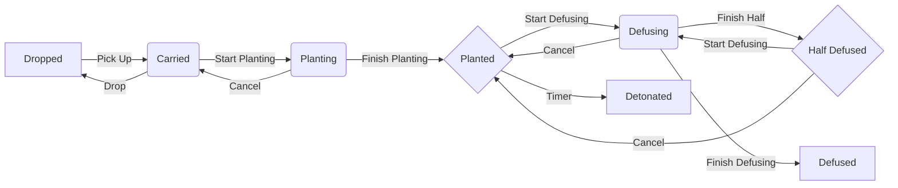
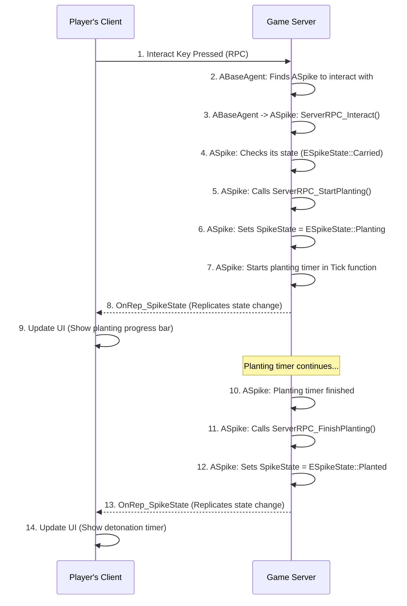

# Spike 시스템

 https://github.com/user-attachments/assets/360060ed-4a26-43bf-b9f8-7558dcd7411b
 > Spike 시스템 요약 영상

## 1. 설계 목표 및 근거 (Design Goals & Rationale)

폭탄 설치 시스템은 라운드 승리의 핵심 목표이며, 설계 시 다음 목표에 중점을 두었습니다.

1.  **서버 권위적(Server-Authoritative) 구조를 통한 공정성 확보**: 스파이크의 상태 변경, 타이머, 상호작용 진행률 등 모든 핵심 데이터는 서버에서만 수정 가능하도록 설계했습니다. 이는 클라이언트 변조를 통한 치팅(예: 즉시 해체)을 원천적으로 차단하고, 모든 플레이어에게 동일한 게임 규칙을 적용하여 공정성을 보장하기 위함입니다.

2.  **상태 관리의 중앙 집중화**: 스파이크의 모든 상태(소지, 설치 중, 해체 완료 등)와 관련 로직을 `ASpike` 액터 내에서 모두 처리하도록 설계했습니다. `ASpike`가 자신의 상태를 직접 관리하는 '스마트 액터'가 되도록 하여, 스파이크와 관련된 모든 코드를 한 곳에서 파악하고 수정할 수 있도록 했습니다.

3.  **유연한 상호작용**: 플레이어의 상호작용(`Interact`) 입력을 받았을 때, `ASpike` 액터가 현재 자신의 상태(`ESpikeState`)를 스스로 판단하여 '줍기', '설치', '해체' 중 적절한 행동을 결정하도록 했습니다. 이를 통해 플레이어의 상호작용 로직은 어떤 대상과 상호작용하는지 알 필요 없이 단일한 인터페이스를 유지할 수 있었습니다.

## 2. 아키텍처 (Architecture)

스파이크 시스템은 `ABaseAgent`와 `ASpike` 액터 간의 RPC 통신을 기반으로 구축되었습니다.

### 핵심 클래스 및 컴포넌트

*   **`ABaseAgent`** ([View on GitHub](https://github.com/chungheonLee0325/VALORANT/tree/main/UnrealEngine/Valorant/Source/Valorant/Player/Agent/BaseAgent.h)): 플레이어 캐릭터입니다. 상호작용 키를 누르면 현재 바라보고 있는 `ABaseInteractor` (이 경우 `ASpike`)에게 서버 RPC로 상호작용을 요청(`ServerRPC_Interact`)합니다.
*   **`ASpike`** ([View on GitHub](https://github.com/chungheonLee0325/VALORANT/tree/main/UnrealEngine/Valorant/Source/Valorant/ValorantObject/Spike/Spike.h)): 스파이크 액터이자 시스템의 핵심입니다. `ESpikeState` 열거형을 통해 자신의 상태를 관리하는 상태 머신을 가지고 있습니다. 모든 상태 변경은 이 클래스 내부의 서버 RPC 함수(`ServerRPC_StartPlanting`, `ServerRPC_FinishDefusing` 등)를 통해서만 이루어집니다.
*   **`AMatchGameState`**: 게임의 전체 상태를 관리합니다. `ASpike`는 자신의 상태가 최종 상태(폭발 또는 해체 완료)가 되면 `AMatchGameState`에 이를 알려 라운드 종료를 트리거합니다.

### 스파이크 상태 머신

`ASpike` 액터는 내부적으로 다음과 같은 상태를 가지며, 서버의 권위 하에 상태가 전이됩니다.



### 시퀀스 다이어그램: 스파이크 설치

스파이크 설치 과정의 데이터 흐름은 다음과 같습니다.



## 3. 핵심 로직 분석 (Core Logic)

### 상호작용 분기 처리

`ASpike`의 `ServerRPC_Interact_Implementation` 함수는 이 시스템의 핵심적인 구현을 보여줍니다. 이 단일 함수가 스파이크의 현재 상태에 따라 '줍기', '설치', '해체' 로직을 어떻게 분기 처리하는지 보여줍니다.

[View on GitHub: Spike.cpp#L243](https://github.com/chungheonLee0325/VALORANT/blob/main/UnrealEngine/Valorant/Source/Valorant/ValorantObject/Spike/Spike.cpp#L243)
```cpp
void ASpike::ServerRPC_Interact_Implementation(ABaseAgent* InteractAgent)
{
    // ... (Null Check 및 GameMode, PlayerState 로드)

    // 상태에 따른 상호작용 처리
    switch (SpikeState)
    {
    case ESpikeState::Dropped:
        // 떨어진 스파이크 - 공격팀만 주울 수 있음
        if (GameMode->IsAttacker(PS->bIsBlueTeam))
        {
            ServerRPC_PickUp_Implementation(InteractAgent);
        }
        break;

    case ESpikeState::Carried:
        // 소지 중인 스파이크 - 공격팀은 설치 가능
        if (OwnerAgent == InteractAgent && GameMode->IsAttacker(PS->bIsBlueTeam) && 
            IsInPlantZone() && IsGameStateInRound())
        {
            ServerRPC_StartPlanting(InteractAgent);
        }
        break;

    case ESpikeState::Planted:
        // 설치된 스파이크 - 수비팀만 해제 가능
        if (!GameMode->IsAttacker(PS->bIsBlueTeam))
        {
            ServerRPC_StartDefusing(InteractAgent);
        }
        break;

    default:
        break;
    }
}
```
*   **의도**: 이 코드는 '상호작용'이라는 하나의 사용자 입력에 대해, 객체(`ASpike`)가 자신의 내부 상태를 기반으로 맥락에 맞는 적절한 행동을 스스로 결정하도록 하는 객체 지향적 설계를 보여줍니다. 이를 통해 `ABaseAgent`는 상호작용 대상이 스파이크인지, 문인지, 무기인지 전혀 신경 쓸 필요 없이 일관된 인터페이스로 상호작용을 요청할 수 있습니다.

### 진행률 관리: Tick 함수 기반의 상태 진행

설치 또는 해체가 시작되면, `ASpike` 액터는 서버의 `Tick` 함수 내에서 직접 진행률(`InteractProgress`)을 관리합니다. 특히, 상호작용 도중 플레이어가 사망하면 즉시 행동을 취소하는 중요한 예외 처리가 포함되어 있습니다.

[View on GitHub: Spike.cpp#L60](https://github.com/chungheonLee0325/VALORANT/blob/main/UnrealEngine/Valorant/Source/Valorant/ValorantObject/Spike/Spike.cpp#L60)
```cpp
void ASpike::Tick(float DeltaTime)
{
    Super::Tick(DeltaTime);

    if (HasAuthority())
    {
        // 설치 중일 때
        if (SpikeState == ESpikeState::Planting && InteractingAgent)
        {
            // 플레이어가 죽었는지 확인
            if (InteractingAgent->IsDead())
            {
                ServerRPC_CancelPlanting();
                return;
            }

            InteractProgress += DeltaTime;
            MulticastRPC_Progress(InteractProgress, PlantTime);
            if (InteractProgress >= PlantTime) { ServerRPC_FinishPlanting(); }
        }
        // 해체 중일 때
        else if (SpikeState == ESpikeState::Defusing && InteractingAgent)
        {
            // 플레이어가 죽었는지 확인
            if (InteractingAgent->IsDead())
            {
                ServerRPC_CancelDefusing();
                return;
            }

            InteractProgress += DeltaTime;
            MulticastRPC_Progress(InteractProgress, DefuseTime);
            if (!bIsHalfDefused && InteractProgress >= HalfDefuseTime) { CheckHalfDefuse(); }
            if (InteractProgress >= DefuseTime) { ServerRPC_FinishDefusing(); }
        }
    }
}
```
*   **의도**: 진행률 계산을 전적으로 서버의 `Tick` 함수에 위임하고, 플레이어의 사망과 같은 예외 상황을 서버가 직접 처리함으로써, 클라이언트의 상태와 관계없이 항상 공정하고 일관된 게임 규칙을 보장합니다.

## 4. 구현 결과

이 아키텍처를 통해 플레이어는 스파이크를 소지한 채 지정된 구역에서 '상호작용' 키를 길게 눌러 설치를 시작하고, 설치된 스파이크에 다가가 다시 '상호작용' 키를 길게 눌러 해체를 시작할 수 있습니다. 해체는 중간에 키를 떼더라도 50% 이상 진행했다면 그 진행도가 저장되는 체크포인트 기능까지 모두 구현되었습니다. 모든 과정은 서버에서 안전하게 처리되며 UI에 실시간으로 반영됩니다.


## 5. 관련 시스템 (Related Systems)

*   **[Input 및 HUD와 ASC 연동](./1_5_Input_HUD_ASC.md)**: 플레이어의 상호작용 키 입력 처리와 스파이크 상태(설치, 해체 진행률)의 UI 표시는 이 시스템과 직접적으로 연관됩니다.
