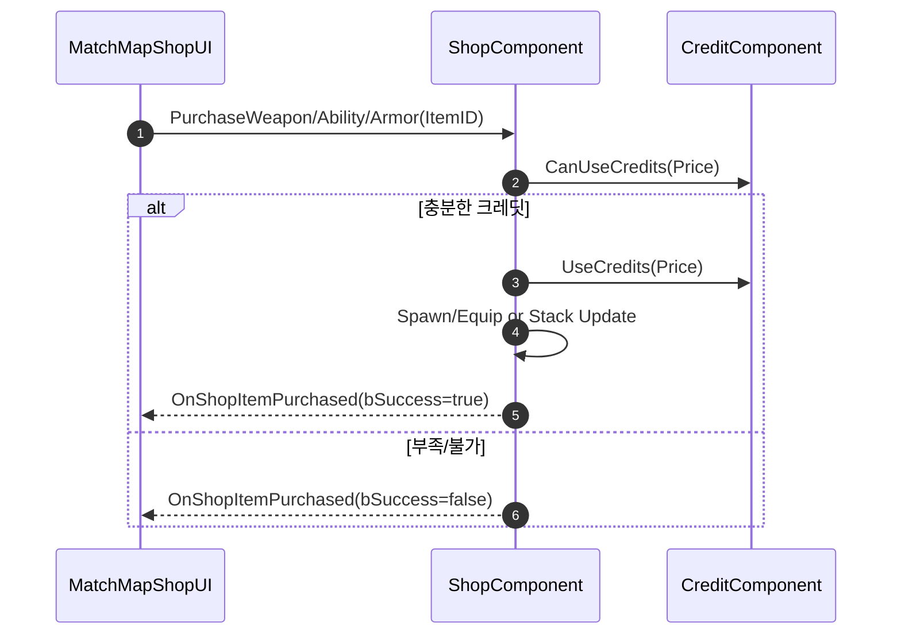
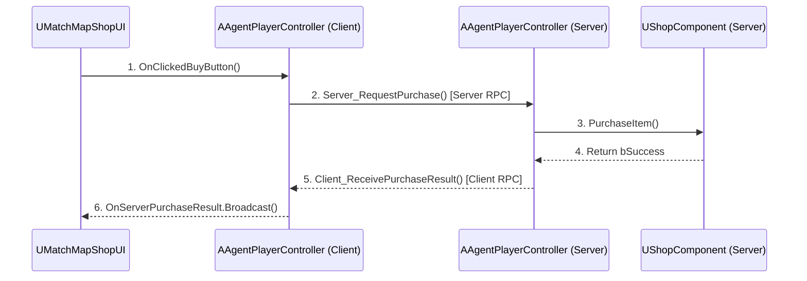

# 상점 및 경제 시스템

https://github.com/user-attachments/assets/c4ddd177-9b8b-4776-bab3-dbbabbb3c2f8
> 상점 및 경제 시스템 요약 영상

## 1. 설계 목표 및 근거 (Design Goals & Rationale)

상점 및 경제 시스템은 게임의 전략적 깊이를 더하는 핵심 요소로, 설계 시 다음 목표에 중점을 두었습니다.

1.  **서버 권위적(Server-Authoritative) 구조**: 아이템 구매, 재화 차감 및 지급 등 모든 경제 관련 핵심 로직은 반드시 서버에서만 처리되도록 설계했습니다. 클라이언트는 단지 서버에 \'구매 요청\'을 보내는 역할만 하며, 실제 데이터 변경은 모두 서버의 검증을 거친 후에만 이루어집니다. 이는 클라이언트 변조를 통한 부당 이득 취득을 원천적으로 차단하는 가장 중요한 설계 목표입니다.

2.  **역할의 명확한 분리**: 시스템을 UI(`UMatchMapShopUI`), 요청 중계(`AAgentPlayerController`), 구매 로직(`UShopComponent`), 재화 데이터(`UCreditComponent`), 재화 분배(`AMatchGameMode`)의 5가지 역할로 명확히 분리했습니다. 이를 통해 각 부분의 코드가 자신의 책임에만 집중하게 하여, 시스템의 복잡도를 낮추고 유지보수성을 크게 향상시켰습니다.

3.  **데이터 기반 아이템 관리**: 상점에서 판매하는 모든 아이템의 정보(가격, 종류, 설명 등)는 데이터 테이블로 구성하고, 데이터를 `UValorantGameInstance`에서 관리하여, 밸런스 수정이나 아이템 추가 시 C++ 코드를 수정할 필요 없이 데이터 테이블만으로 대응할 수 있도록 설계했습니다.

## 2. 아키텍처 (Architecture)

본 시스템은 클라이언트의 UI에서 시작된 구매 요청이 서버의 여러 컴포넌트를 거쳐 처리된 후, 다시 클라이언트로 결과를 반환하는 명확한 RPC 기반 아키텍처를 가집니다.

### 핵심 클래스 및 컴포넌트

*   **`UMatchMapShopUI`** ([View on GitHub](https://github.com/chungheonLee0325/VALORANT/tree/main/UnrealEngine/Valorant/Source/Valorant/UI/MatchMap/MatchMapShopUI.h)): 상점 UI 위젯입니다.
*   **`AAgentPlayerController`** ([View on GitHub](https://github.com/chungheonLee0325/VALORANT/tree/main/UnrealEngine/Valorant/Source/Valorant/Player/AgentPlayerController.h)): 클라이언트와 서버 간의 중계자 역할을 합니다.
*   **`UShopComponent`** ([View on GitHub](https://github.com/chungheonLee0325/VALORANT/tree/main/UnrealEngine/Valorant/Source/Valorant/Player/Component/ShopComponent.h)): **서버 측에서** 실제 구매 로직을 처리합니다.
*   **`UCreditComponent`** ([View on GitHub](https://github.com/chungheonLee0325/VALORANT/tree/main/UnrealEngine/Valorant/Source/Valorant/Player/Component/CreditComponent.h)): 플레이어의 재화(`CurrentCredit`)를 서버 권위적으로 관리합니다.
*   **`AMatchGameMode`** ([View on GitHub](https://github.com/chungheonLee0325/VALORANT/tree/main/UnrealEngine/Valorant/Source/Valorant/GameManager/MatchGameMode.h)): 라운드 결과에 따른 재화 분배를 총괄합니다.



### 네트워크 통신 흐름



## 3. 핵심 로직 분석: 상점 시스템

### 안전한 구매 요청 파이프라인

구매 요청은 3단계 RPC 함수 호출을 통해 클라이언트 -> 서버 -> 클라이언트로 이어지는 안전한 파이프라인을 구성합니다. 이를 통해 클라이언트가 절대로 직접 구매 로직을 실행할 수 없도록 보장합니다.

[View on GitHub: AgentPlayerController.cpp#L448](https://github.com/chungheonLee0325/VALORANT/blob/main/UnrealEngine/Valorant/Source/Valorant/Player/AgentPlayerController.cpp#L448)
```cpp
void AAgentPlayerController::RequestPurchaseWeapon(int32 WeaponID)
{
	Server_RequestPurchaseWeapon(WeaponID); // 1. 클라이언트가 서버 RPC 호출
}

void AAgentPlayerController::Server_RequestPurchaseWeapon_Implementation(int32 WeaponID)
{
	ShopComponent->PurchaseWeapon(WeaponID); // 2. 서버에서 실제 로직 실행
}
```

### 서버 측 구매 검증 및 환불 로직
`UShopComponent`는 서버에서 구매 요청을 받으면, 단순히 재화만 확인하는 것이 아니라 아이템의 종류에 따라 복잡한 조건과 환불 규칙을 함께 검증합니다.

[View on GitHub: ShopComponent.cpp#L507](https://github.com/chungheonLee0325/VALORANT/blob/main/UnrealEngine/Valorant/Source/Valorant/Player/Component/ShopComponent.cpp#L507)
```cpp
bool UShopComponent::CanPurchaseItem(int32 ItemID, EShopItemType ItemType, int32& OutRefund)
{
  // 무기 구매 시: 현재 장착한 무기와 동일 카테고리인지 확인
  // 만약 동일 카테고리의 다른 무기를 구매하는 것이라면, 기존 무기 가격을 OutRefund에 계산하여 반환
  // 최종적으로 필요한 비용(Cost - OutRefund)을 현재 보유액과 비교
  return CreditComp->CanUseCredits(Cost - OutRefund);
}


bool UShopComponent::PurchaseWeapon(int32 WeaponID)
{
  // CanPurchaseItem을 통해 환불액 계산 및 구매 가능 여부 확인
  // 환불액이 있다면 먼저 AddCredits로 재화 추가
  // UseCredits로 최종 비용 차감
  // SpawnWeaponForPlayer로 무기 생성 및 장착
}
```
*   **의도**: 이처럼 상세한 검증과 환불 로직을 서버에 중앙화함으로써, '실수로 다른 총을 구매했을 때 기존 총을 자동으로 팔아주는' 것과 같은 편의 기능을 안정적으로 제공하는 동시에, 모든 경제 활동이 서버의 통제 하에 투명하게 이루어지도록 보장합니다.

## 4. 핵심 로직 분석: 경제 시스템

`UCreditComponent`는 플레이어의 재화를 관리하고, `AMatchGameMode`는 라운드 결과에 따라 이 컴포넌트에 재화를 분배하는 역할을 합니다.

*   **컴포넌트**: `UCreditComponent` (플레이어별 재화 저장, Replicated 속성으로 UI 자동 동기화)
*   **핵심 API**: `AddCredits`, `UseCredits`, `CanUseCredits`, `ResetForNewRound`
*   **보상 규칙 (in `AMatchGameMode`)** ([View on GitHub](https://github.com/chungheonLee0325/VALORANT/tree/main/UnrealEngine/Valorant/Source/Valorant/GameManager/MatchGameMode.cpp)):
    *   `AwardRoundEndCredits(bIsWinner, ConsecutiveLosses)`: 라운드 승/패 및 연속 패배 횟수에 따라 차등적으로 크레딧 지급
    *   `AwardKillCredits()`: 적 처치 시 고정 크레딧 지급
    *   `AwardSpikeActionCredits(bIsPlant)`: 스파이크 설치 또는 해체 성공 시 팀 전원에게 보너스 크레딧 지급

## 5. 설계적 절충 및 개선점

### 현재 구현: 경제 관련 상수의 코드 내 관리

*   **내용**: 현재 시스템에서 아이템의 가격 정보는 데이터 테이블로 관리되고 있지만, 킬 보상(`KillReward`), 라운드 승리 보상(`RoundWinReward`) 등 게임의 핵심 경제 규칙을 결정하는 상수들은 `UCreditComponent`의 C++ 생성자에 하드코딩되어 있습니다.
*   **설계적 절충**: 이는 초기 개발 단계에서 빠르게 경제 시스템의 기본 틀을 구현하기 위한 선택이었습니다. 하지만 이 방식은 게임 밸런스를 조절해야 할 때마다 C++ 코드를 직접 수정하고 재컴파일해야 하는 큰 단점을 가집니다.

### 개선 방안: 경제 규칙 데이터화

*   **내용**: 장기적인 유지보수성과 확장성을 위해, `UCreditComponent` 내부에 하드코딩된 경제 관련 상수들을 별도의 **데이터 에셋(Data Asset)**이나 **설정 파일(.ini)**로 추출하는 개선이 필요합니다. `UCreditComponent`는 시작 시 이 파일을 읽어 자신의 멤버 변수들을 초기화하도록 변경합니다.
*   **기대 효과**: 이 개선을 통해, 기획자나 디자이너는 엔지니어의 도움 없이 직접 데이터 에셋이나 설정 파일의 값을 수정하는 것만으로 게임의 경제 밸런스를 자유롭게 테스트하고 튜닝할 수 있게 됩니다. 이는 프로젝트의 데이터 기반 설계 철학을 더욱 강화하고, 개발 효율성을 크게 향상시킬 것입니다.

## 6. 관련 시스템 (Related Systems)

*   **[Input 및 HUD와 ASC 연동](./1.5_Input_HUD_ASC.md)**: 상점 UI를 열고 닫는 입력 처리, 그리고 상점에서 구매하는 스킬의 보유량을 HUD에 표시하는 로직이 이 시스템과 연관됩니다.
*   **[GAS 소개 및 아키텍처](./1.2_Project-GAS-Architecture.md)**: 상점에서 구매하는 스킬 최대 충전 횟수는 서버의 `ShopComponent`가 플레이어의 데이터를 참조하여 초기화 됩니다.
