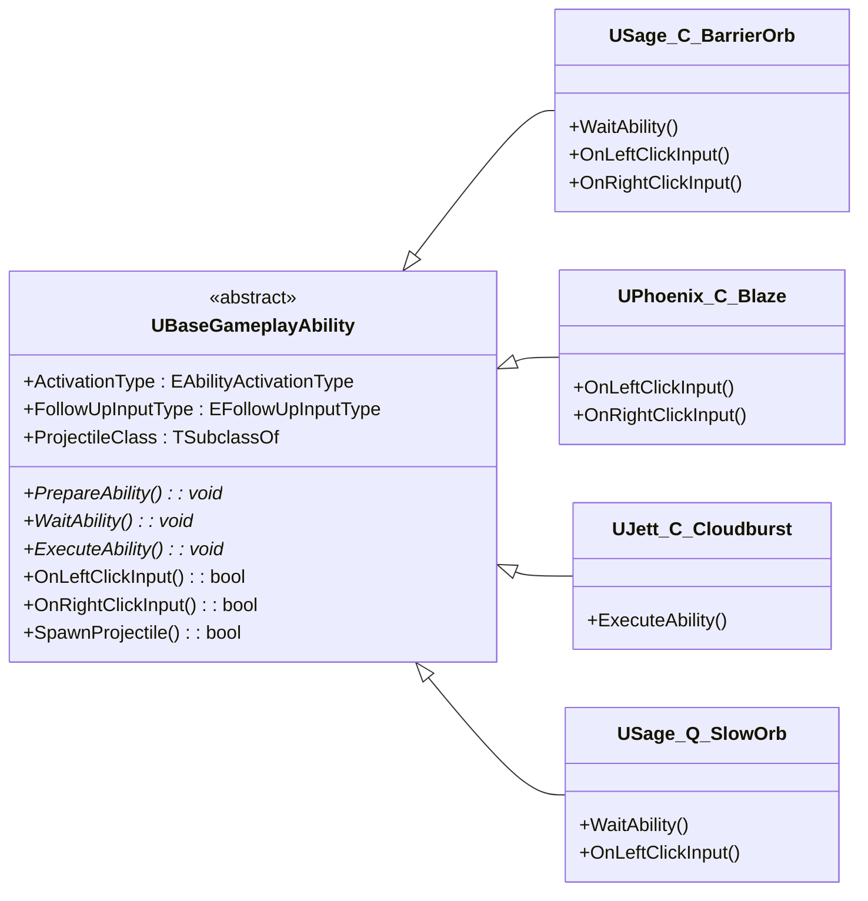
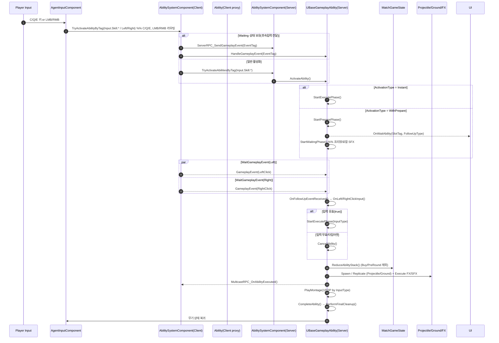

# VALORANT.Source — source-only mirror

> 이 리포는 **소스 코드 전용 미러**입니다.
> 전체 프로젝트(에셋 포함)와 **풀 README**는 원본 리포에서 확인하세요:
> 👉 [VALORANT (Main Repo)](https://github.com/chungheonLee0325/VALORANT)

포함: `Source/`, `Config/`, `Plugins/*/Source`, `Valorant.uproject`, `Doc/`
제외: `Content/`, `Binaries/`, `Intermediate/`

---

<b>Full README (from main repo)</b>

# VALORANT - Multiplay Hypher FPS 게임 (UE, Multiplayer, GAS)

## 🎯 프로젝트 요약
언리얼 엔진 5와 C++ Gameplay Ability System(GAS)을 기반으로 한 **멀티플레이어 FPS 전투 시스템**을 설계·구현했습니다.  
Phoenix, Sage, KAY/O, Jett — 4명의 Agent × C/Q/E 총 12종 스킬을 멀티플레이 환경에서 완벽히 동기화하였으며, Spike·상점·라운드 진행·네트워크 구조까지 포함한 **GAS 기반 확장형 전투 아키텍처**를 구축했습니다.

---

## **프로젝트 하이라이트**
### 📌 결과물 요약
프로젝트의 주요 결과물과 핵심 기능을 한눈에 볼 수 있는 영상입니다. \
아래 gif를 클릭하면 유튜브 영상으로 시청할 수 있습니다.

- 프로젝트 요약\

---

## 🏆 내 주요 성과
- **GAS 기반 스킬 프레임워크(`UBaseGameplayAbility`) 설계**
   - 상태머신(Preparing → Waiting → Active)
   - 입력 하이재킹 / Projectile·GroundEffect 모듈화
- **후속입력형 스킬** — Phoenix Blaze, Sage Barrier Orb
- **즉발형 스킬** — Jett Tailwind, KAY/O Flash 등
- **Spike 상태머신** — 설치/반해체/해체 로직
- **상점·경제 시스템** — 서버 검증 구매, 데이터 테이블 기반 UI

---
## 🏗 BaseGameplayAbility 아키텍처

`UBaseGameplayAbility`는 모든 에이전트 스킬의 **공통 상태머신(Preparing → Waiting → Executing)**, **후속입력 처리(좌/우클릭)**, **서버 권위 실행/복제**, **Projectile/GroundEffect 스폰**을 표준화하는 베이스 클래스입니다.

### BaseGameplayAbility 속성
BaseGameplayAbility는 스킬의 동작 방식을 제어하는 몇 가지 핵심 속성을 가집니다.

- **ActivationType** – 스킬 발동 플로우 유형
    - `Instant`: 즉시 실행 스킬 - 바로 몽타주 재생과 함께 Executing 상태로 전이 (예: Jett – Cloudburst) 
    - `WithPrepare`: Prepare 상태 이후 후속입력 대기 상태(WaitPahse)로 전환 (예: Sage – Barrier Orb, Phoenix - Blaze)

- **FollowUpInputType** – Waiting 상태에서 허용하는 후속입력 종류
    - `None`: 후속입력 없음
    - `LeftClick`: 좌클릭만 허용
    - `RightClick`: 우클릭만 허용
    - `LeftOrRight`: 좌·우클릭 모두 허용
  

---

### 🧩 파생 어빌리티별 특징
- **Sage – Barrier Orb (C)**
    - `ActivationType = WithPrepare`
    - `FollowUpInputType = LeftOrRight`
    - `WaitAbility()`: 로컬 프리뷰 벽 생성/업데이트
    - `OnRightClickInput()`: 프리뷰 회전
    - `OnLeftClickInput()`: 서버 권위 설치 확정 → 어빌리티 종료

- **Phoenix – Blaze (C)**
    - `ActivationType = WithPrepare`
    - `FollowUpInputType = LeftOrRight`
    - `OnLeftClickInput()`: 서버 권위 직선 spline wall 확정 → 어빌리티 종료
    - `OnRightClickInput()`: 서버 권위 곡선 spline wall 확정 → 어빌리티 종료

- **Sage – Slow Orb (Q)**
    - `ActivationType = WithPrepare`
    - `FollowUpInputType = LeftClick`
    - `WaitAbility()`: 프리뷰 오브 생성
    - `OnLeftClickInput()`: 서버 권위 투척 확정 → 어빌리티 종료

- **Jett – Cloudburst (C)**
    - `ActivationType = Instant`
    - `FollowUpInputType = None`
    - `ExecuteAbility()`: 즉발형, 투사체 스폰만 수행

---

## 🔄 Ability 활성화 흐름

### 구현 포인트 요약
- **입력 라우팅**: `AgentInputComponent`가 C/Q/E/LMB/RMB 입력을 **ASC로 태그 기반 전달**
- **Waiting 중 입력 처리**: ASC는 **Waiting 상태면** 활성 어빌리티로 **GameplayEvent**를 보냄
- **Activation Type 분기**: BaseAbility가 `ActivationType`에 따라 **즉발** 또는 **준비→대기**로 전환
- **Waiting State 처리**: `OnWaitAbility()` 브로드캐스트로 **HUD 안내**, 좌/우클릭 이벤트 대기
- **후속 입력 수신**: 태그에 따라 `OnLeftClickInput/OnRightClickInput` 호출 → 실행
- **Executing(서버 권위)**: 스킬 스택 차감, VFX/SFX 멀티캐스트, 투사체/그라운드 스폰 후 복제
- **정리/복귀**: 몽타주 완료 → `CompleteAbility()` → 무기 상태 복귀

**사운드 재생 원칙:**
- **준비 단계(Preparing)** — 시전자 전용(2D) 사운드로 피드백
- **실행 단계(Executing)** — Multicast 사운드로 모든 플레이어에게 사용 알림
---

## 설치 & 실행
1) **요구사항**: UE 5.5, Visual Studio 2022(C++), (멀티 테스트 시) Steam 실행
2) **빌드**: `Valorant.uproject` → *Generate Visual Studio project files* → `Valorant.sln` 열기 →  
   구성 `Development Editor`로 `Valorant` 빌드
3) **실행**: 에디터에서 `Lobby` 또는 `Game` 맵 열기 → **Play**
  - Net Mode: *Listen Server / Client* 또는 Standalone 다중 인스턴스

## 주요 조작키
* **이동:** W, A, S, D
* **시점 조작:** 마우스 이동
* **기본 공격 / 스킬 발동:** 마우스 좌클릭
* **스킬 보조 입력:** 마우스 우클릭
* **점프:** 스페이스 바
* **질주:** Shift
* **걷기 / 회피:** Ctrl
* **재장전:** R
* **무기 전환:** 숫자키 1~4, 마우스 휠
* **스킬 C:** C
* **스킬 Q:** Q
* **스킬 E:** E
* **스파이크 설치:** 숫자키 4
* **스파이크 해체 / 상호작용:** F
* **상점 열기 / 닫기:** B
> 스킬 준비 상태에서는 **입력 라우팅**이 변경됩니다(무기 발사 / 스킬 보조 입력 → 스킬 후속 입력).

---

## 🔗 대표 코드 링크
- [BaseGameplayAbility.h](UnrealEngine/Valorant/Source/Valorant/AbilitySystem/Abilities/BaseGameplayAbility.h)
- [Phoenix_C_BlazeSplineWall.cpp](UnrealEngine/Valorant/Source/Valorant/AbilitySystem/Abilities/Phoenix/Phoenix_C_BlazeSplineWall.cpp)
- [Sage_C_BarrierOrb.cpp](UnrealEngine/Valorant/Source/Valorant/AbilitySystem/Abilities/Sage/Sage_C_BarrierOrb.cpp)
- [FlashComponent.cpp](UnrealEngine/Valorant/Source/Valorant/Player/Component/FlashComponent.cpp)
- [Spike.cpp](UnrealEngine/Valorant/Source/ValorantObject/Spike/Spike.cpp)
- [ShopComponent.cpp](UnrealEngine/Valorant/Source/Valorant/Player/Component/ShopComponent.cpp)

